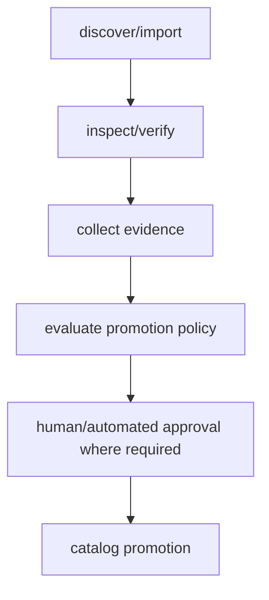
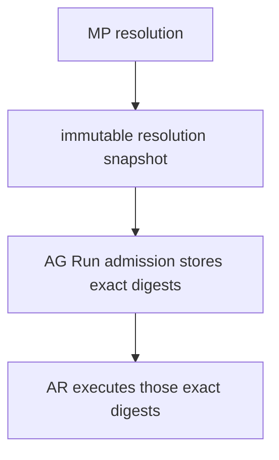
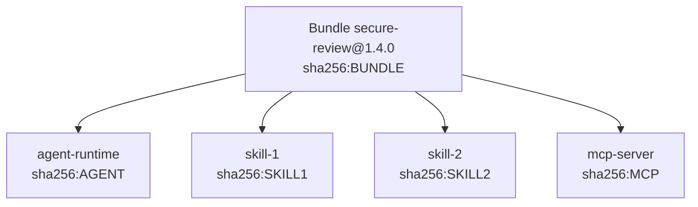
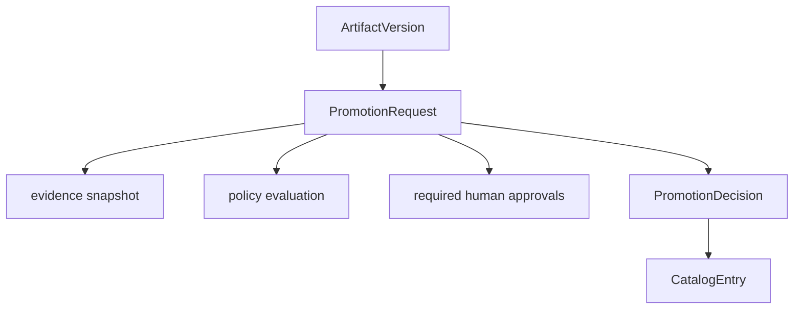
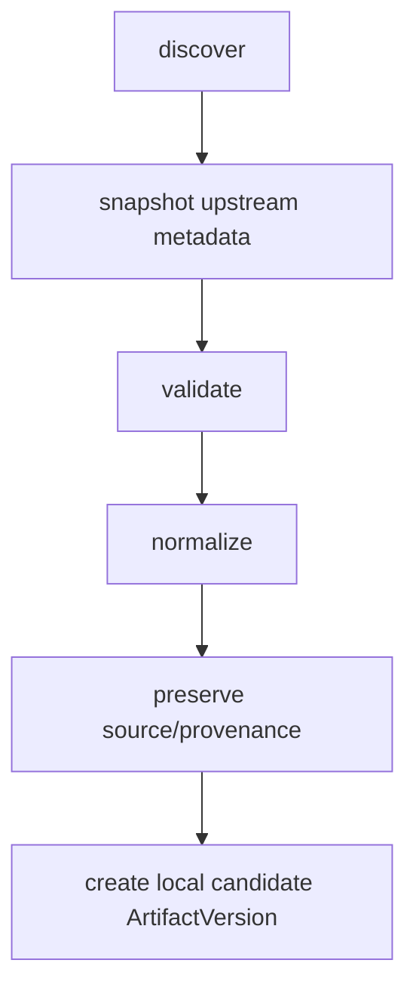
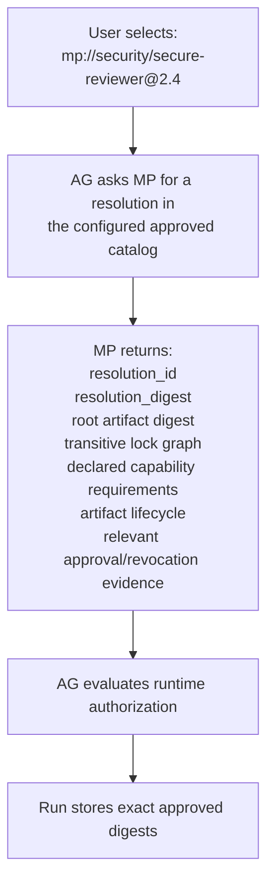
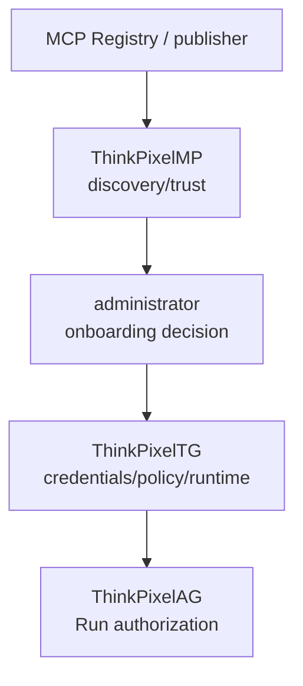
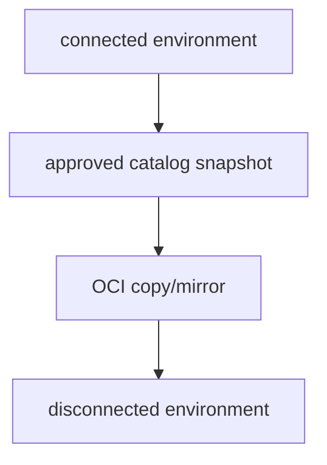

# ThinkPixelMP Implementation Plan

## 1. Purpose

This document is the implementation contract for taking ThinkPixelMP from an empty repository to a release candidate.

ThinkPixelMP is the **Marketplace and agentic software supply-chain plane** of the ThinkPixel stack. It provides vendor-neutral discovery, immutable artifact identity, OCI-compatible distribution metadata, publisher identity, provenance, security/evaluation evidence, dependency resolution, catalog curation, controlled promotion, and revocation for agentic artifacts.

`TODO.md` is the chronological execution ledger. This plan explains why and how; the checklist records what remains, what was implemented, and what evidence verified each implementation step.

The core design thesis is:

> **ThinkPixelMP qualifies software. ThinkPixelAG authorizes behavior. ThinkPixelAR executes it.**

The foundational security invariants are:

> **Marketplace availability is not runtime authority.**

> **Artifact metadata cannot grant infrastructure privilege.**

> **Installing or selecting an artifact cannot expand capability authority.**

> **Production artifact identity is immutable and content-addressed.**

> **Evidence applies only to the exact artifact digest it evaluated.**

---

## 2. Product boundary

ThinkPixelMP owns marketplace and software-supply-chain state:

- publisher identities and namespaces;
- artifact logical identities;
- immutable artifact versions;
- OCI and other source/distribution references;
- artifact-kind metadata;
- artifact descriptors;
- dependency graphs;
- resolved dependency lock graphs;
- publisher declarations and runtime/capability requirements;
- signature verification results;
- provenance metadata;
- SBOM metadata;
- vulnerability/security evidence;
- license evidence;
- evaluation evidence;
- human review evidence;
- remote endpoint verification evidence;
- catalog definitions;
- catalog membership;
- promotion decisions;
- deprecation;
- quarantine;
- revocation;
- import/federation source configuration;
- marketplace search and discovery;
- auditable publication and promotion history;
- immutable marketplace resolution snapshots;
- marketplace events and supply-chain evidence export.

ThinkPixelMP does **not** own:

- runtime authorization for a particular principal or Run;
- granting capabilities requested by an artifact;
- agent Run admission;
- agent resource envelopes;
- runtime Session state;
- Kubernetes sandbox execution;
- model routing/provider credentials;
- enterprise tool execution/downstream credentials;
- runtime guardrail enforcement;
- OCI blob storage;
- CI/build infrastructure;
- vulnerability-scanner implementation;
- malware-scanner implementation;
- agent-evaluation framework implementation;
- billing/payments/revenue sharing in the first release;
- public ratings/reviews/social features;
- cognitive agent memory;
- RAG/knowledge indexing.

When integrated with the complete ThinkPixel platform:

- **ThinkPixelMP** establishes artifact identity, evidence, discovery, eligibility, promotion, and revocation;
- **ThinkPixelAG** decides whether a particular governed Run may use an exact artifact digest and capability set;
- **ThinkPixelAR** materializes approved agent-runtime artifacts into isolated execution;
- **ThinkPixelTG** operates/governs tool and MCP integrations and owns downstream credentials;
- **ThinkPixelLLMGW** owns model access and provider credentials;
- **ThinkPixelGR** evaluates applicable runtime content/risk policy;
- external **OCI registries** store artifact bytes.

ThinkPixelMP must remain independently useful as a private enterprise marketplace/catalog without requiring the rest of ThinkPixel.

---

## 3. Product principles

### 3.1 Metadata is not authority

An artifact may declare:

    requires:
      capabilities:
        - scm.repository.read
        - scm.pull_request.read

ThinkPixelMP may validate and record that declaration.

It must never convert that declaration into runtime authority.

The invariant is:

    DeclaredCapabilityRequirement != GrantedCapability

and:

    MarketplaceEligibility != RunAuthorization

If ThinkPixelAG is configured, AG remains the only ThinkPixel component responsible for determining whether a specific Run receives those capabilities.

### 3.2 Marketplace metadata is untrusted input

Publisher-controlled metadata is descriptive.

It may declare requirements such as:

- required capabilities;
- optional capabilities;
- required sandbox class;
- architecture;
- memory;
- storage;
- network requirements;
- adapter compatibility;
- external protocols.

It may not directly configure privileged infrastructure.

For example, an artifact must never be able to cause these merely by declaring them:

    privileged: true
    hostNetwork: true
    hostPath: /
    secret: github-admin-token
    serviceAccount: cluster-admin

Trusted AR/operator configuration maps validated abstract requirements to runtime implementation.

### 3.3 Content-addressed identity

Human-friendly versions are useful for discovery:

    security-reviewer:2.4.1

Production identity is:

    sha256:<digest>

Every ArtifactVersion resolves to an immutable digest.

Tags and semantic versions never replace digest identity.

Approvals, evaluations, revocations, resolutions, and runtime references bind to immutable digests.

### 3.4 No silent update

A newly published upstream version does not automatically replace an approved version.

The lifecycle is explicit:

Existing approved references remain pinned to their exact digests until an explicit promotion/resolution change occurs.

### 3.5 Evidence is multidimensional

ThinkPixelMP must not reduce trust to one opaque score.

It tracks independent assertions including:

- publisher identity;
- namespace ownership;
- signature authenticity;
- provenance;
- SBOM presence;
- vulnerability results;
- malware/static-analysis results;
- license results;
- evaluation results;
- human review;
- runtime compatibility;
- endpoint verification;
- catalog approval.

A valid signature does not imply that an artifact is secure.

A vulnerability scan does not prove publisher identity.

An evaluation does not prove software provenance.

Each evidence type remains separately inspectable.

### 3.6 Evidence binds to exact content

Evidence for:

    sha256:AAA

cannot be applied to:

    sha256:BBB

even when both claim the same semantic version or tag.

Every EvidenceRecord includes the exact subject digest.

### 3.7 The catalog is not the blob store

ThinkPixelMP does not implement OCI distribution storage.

Artifact bytes live in external infrastructure such as:

- Harbor;
- GHCR;
- Quay;
- ECR;
- GAR;
- ACR;
- another OCI 1.1-compatible registry.

ThinkPixelMP stores references, metadata, verification results, evidence, policy decisions, and promotion state.

Registry integration is behind a port.

### 3.8 Preserve native standards

Do not invent a proprietary schema where a mature open standard exists.

Initial mappings should prefer:

- Agent Skills for portable skills;
- MCP server descriptors for MCP servers;
- A2A Agent Cards for remote agents;
- OCI 1.1 for local artifact distribution;
- Sigstore/Cosign-compatible signatures and attestations;
- SPDX or CycloneDX for SBOMs;
- SLSA-compatible provenance where available.

ThinkPixel-specific schemas are justified for:

- `agent-runtime`;
- `bundle`;
- marketplace catalog snapshots;
- marketplace resolution/lock manifests;
- ThinkPixel approval/revocation attestations where no interoperable format is sufficient.

### 3.9 Importing does not rewrite history

When ThinkPixelMP repackages an upstream non-OCI artifact into OCI, provenance must preserve:

- original publisher;
- original source;
- source revision/digest;
- importer identity/version;
- import timestamp;
- resulting OCI digest.

ThinkPixelMP must never imply that an upstream publisher signed an artifact format the publisher did not create.

### 3.10 Promotion is contextual

Approval is not one global boolean.

The same digest may simultaneously be:

    experimental: allowed
    engineering: allowed
    finance: denied
    production: denied

Catalog membership represents contextual eligibility.

Artifact lifecycle and catalog eligibility remain separate concepts.

### 3.11 Deprecation and revocation are different

`deprecated` means:

> New use is discouraged or disallowed according to policy; historical/existing use may remain valid.

`revoked` means:

> This exact artifact is known or considered unsafe/untrusted and must be rejected according to revocation policy.

Revocation is historical evidence and is never implemented by deleting the artifact record.

### 3.12 MP is not a runtime hot-path dependency

A normal governed execution should not synchronously depend on MP availability after its artifact graph has already been resolved and authorized.

Preferred flow:

Temporary MP unavailability must not automatically terminate correctly authorized Runs.

---

## 4. Artifact model

### 4.1 Initial artifact kinds

The marketplace model supports the following canonical kinds.

#### `skill`

Portable instructions/assets following the Agent Skills model.

Typical payload:

- `SKILL.md`;
- scripts;
- reference files;
- supporting assets.

Distribution:

- OCI artifact preferred for ThinkPixel-controlled distribution;
- upstream Git/source may be imported and repackaged with preserved provenance.

#### `agent-runtime`

Executable agent package intended for ThinkPixelAR or another compatible runtime.

This is the primary ThinkPixel-specific artifact contract.

It includes:

- immutable OCI image reference;
- HarnessAdapter kind;
- adapter compatibility range;
- process/entrypoint metadata;
- Workspace mount expectations;
- durable vendor-state paths;
- abstract Runtime Profile requirements;
- architecture/platform requirements;
- declared capability requirements;
- declared network requirements.

#### `mcp-server`

An MCP server descriptor plus distribution information.

Supported delivery modes may include:

- OCI/container;
- remote endpoint;
- other upstream package distributions for discovery/import.

ThinkPixelMP catalogs the server.

ThinkPixelTG remains responsible for actually operating/governing enterprise MCP access.

#### `remote-agent`

Remote agent described by an A2A Agent Card.

The artifact records an immutable verified snapshot of:

- Agent Card;
- card digest;
- card signature where available;
- endpoint;
- publisher;
- protocol metadata;
- declared skills/capabilities;
- endpoint verification state.

MP must clearly distinguish remote-service assurance from locally inspectable OCI artifact assurance.

#### `bundle`

ThinkPixel composition artifact referencing multiple other artifacts.

Example:

    bundle: secure-pr-review

      agent-runtime:
        codex-reviewer@sha256:A

      skills:
        secure-code-review@sha256:B
        go-security@sha256:C

      tools:
        github-mcp@sha256:D

Bundle dependencies resolve to exact immutable digests.

A Bundle never receives the union of dependency capabilities automatically.

### 4.2 Artifact class

Artifact kind and trust/operation class are separate.

Useful classes include:

- `instructional`;
- `executable-local`;
- `remote-service`;
- `composite`.

Evidence requirements may differ by class.

For example, an executable OCI image can have an SBOM and vulnerability scan, while a remote SaaS agent may expose only signed descriptor and endpoint evidence.

### 4.3 Delivery model

Delivery model is independent from artifact kind.

Initial values should cover concepts such as:

    oci
    remote
    imported-source

Future values may include additional ecosystem package registries without changing artifact-kind semantics.

---

## 5. Domain model

Principal entities:

- `Publisher`;
- `Namespace`;
- `Artifact`;
- `ArtifactVersion`;
- `ArtifactDescriptor`;
- `ArtifactSource`;
- `ArtifactRequirement`;
- `ArtifactDependency`;
- `ArtifactLock`;
- `ArtifactResolution`;
- `EvidenceRecord`;
- `EvidenceSubject`;
- `Catalog`;
- `CatalogEntry`;
- `CatalogPolicy`;
- `PromotionRequest`;
- `PromotionDecision`;
- `Deprecation`;
- `Revocation`;
- `ImportSource`;
- `ImportRecord`;
- `RemoteEndpoint`;
- `IdempotencyRecord`;
- `AuditEvent`;
- `OutboxMessage`.

IDs are opaque UUIDv7 values.

Timestamps are UTC and enter domain state through an injectable clock.

Tenant-owned state is explicitly scoped by `tenant_id`.

Public/federated artifacts are imported into local tenant/repository state rather than creating implicit cross-tenant authority.

---

## 6. Publisher and namespace identity

### 6.1 Publisher

A Publisher represents the entity claiming responsibility for an artifact namespace.

Publisher types may eventually include:

- organization;
- individual;
- automated build identity;
- imported upstream publisher.

Publisher state must distinguish:

- claimed;
- verified;
- suspended;
- revoked.

### 6.2 Namespace

Artifacts live under stable namespaces such as:

    acme/security/secure-reviewer
    thinkpixel/skills/go-review

Namespace ownership must be explicit.

One publisher cannot publish into another verified namespace without delegated authorization.

### 6.3 Verification

Publisher/namespace verification is independent from artifact security approval.

Verification mechanisms may include:

- administrative enterprise ownership;
- OIDC organization identity;
- source repository ownership;
- DNS/domain challenge;
- Sigstore identity;
- configured federation trust.

The first private-enterprise release may begin with administrator-controlled namespace ownership while keeping verification seams for future public/federated operation.

---

## 7. Artifact version registration

Artifact versions are immutable after acceptance.

Registration must resolve:

- canonical source;
- immutable digest;
- media/artifact type;
- descriptor digest;
- publisher/namespace;
- semantic version if supplied;
- distribution references.

If a tag is submitted:

    registry.example/agent:2.0

MP resolves and stores:

    registry.example/agent@sha256:...

The tag is retained only as source metadata.

Re-registering the same logical semantic version with a different digest must either be rejected or represented as an explicit immutable replacement event according to policy.

It must never silently rewrite history.

---

## 8. OCI integration

### 8.1 RegistryProvider

Define a registry port similar to:

    type RegistryProvider interface {
        Resolve(ctx context.Context, ref ArtifactReference) (Descriptor, error)
        FetchManifest(ctx context.Context, digest Digest) (Manifest, error)
        ListReferrers(ctx context.Context, digest Digest) ([]Descriptor, error)
        FetchArtifact(ctx context.Context, ref ArtifactReference, limits FetchLimits) (ArtifactReader, error)
        Copy(ctx context.Context, source, target ArtifactReference) (Descriptor, error)
    }

The exact API is finalized during Phase 0.

The domain must not import ORAS-specific or registry-client types.

### 8.2 OCI 1.1

Prefer OCI 1.1-compatible artifact distribution.

Use referrers where supported for attached evidence such as:

- signatures;
- attestations;
- SBOMs;
- provenance;
- evaluations;
- promotion attestations.

Fallback behavior for registries without complete referrer support must be documented.

### 8.3 ORAS

ORAS is the preferred initial implementation candidate for generic OCI artifact interaction.

This is an adapter choice, not a domain dependency.

### 8.4 Registry credentials

Registry credentials are operator-managed secrets.

Publisher-supplied descriptors cannot select arbitrary credential identities.

Credentials must be:

- registry-scoped;
- least privilege;
- redacted from logs/events;
- excluded from metadata responses;
- independently rotatable.

### 8.5 Safe inspection

MP must treat OCI layers and imported archives as hostile input.

Inspection must enforce:

- maximum manifest size;
- maximum number of layers/files;
- maximum compressed/uncompressed size;
- decompression-ratio limits;
- extraction path validation;
- no path traversal;
- no symlink escape;
- no device-file creation;
- no executable hooks;
- no script execution;
- bounded parsing time;
- content-type validation.

ThinkPixelMP should inspect metadata and content statically.

It must not execute the artifact merely to determine whether it is safe.

---

## 9. Descriptor validation

Each artifact kind has a validator.

### 9.1 Skills

Validate:

- required Skill metadata;
- canonical file layout;
- bounded file sizes/count;
- schema rules;
- declared requirements;
- duplicate/conflicting metadata.

Do not execute included scripts during marketplace validation.

### 9.2 Agent runtimes

Validate:

- ThinkPixel runtime manifest schema;
- image digest;
- HarnessAdapter identifier;
- adapter compatibility;
- state paths;
- Workspace mount declaration;
- runtime requirements;
- capability requirements;
- network requirements;
- platform/architecture requirements.

Runtime declarations remain requirements, never Kubernetes configuration.

### 9.3 MCP servers

Validate:

- MCP server descriptor schema;
- transport/delivery metadata;
- remote/local mode;
- required authentication declaration;
- tool metadata where available;
- distribution references.

Do not interpret MCP metadata as automatic TG onboarding.

### 9.4 Remote agents

Validate:

- A2A Agent Card;
- endpoint URL;
- supported protocol/version;
- card signature where present;
- endpoint ownership/verification metadata;
- declared skills/capabilities.

Remote endpoint fetching is subject to strict SSRF protections.

### 9.5 Bundles

Validate:

- dependency references;
- allowed artifact kinds;
- cycles;
- duplicate/conflicting components;
- requirement aggregation;
- version constraints.

Publication keeps author-friendly constraints.

Promotion/runtime resolution produces exact immutable lock graphs.

---

## 10. Dependency and resolution model

### 10.1 Dependency declaration

Artifacts may declare dependencies using:

- exact digest;
- exact semantic version;
- bounded semantic range where authoring flexibility is needed.

Mutable tags are not valid final production dependencies.

### 10.2 Lock graph

A successful resolution creates an immutable `ArtifactLock`.

Example:

The lock contains:

- root artifact;
- all transitive dependencies;
- exact digests;
- dependency edges;
- resolution algorithm version;
- catalog/policy context;
- evidence snapshot references;
- created timestamp;
- lock digest.

### 10.3 Resolution

An `ArtifactResolution` is a durable marketplace decision that:

- identifies a root artifact;
- identifies a catalog/context;
- contains or references an ArtifactLock;
- records relevant promotion/evidence state;
- records policy decision;
- has an immutable resolution digest.

ThinkPixelAG should consume a resolution/digest rather than repeatedly resolving mutable marketplace names during Run admission.

### 10.4 Dependency safety

Resolution fails on:

- cycle;
- revoked dependency;
- missing required dependency;
- incompatible constraint;
- policy-ineligible dependency;
- invalid artifact kind relationship;
- unresolved mutable reference;
- unavailable required evidence according to policy.

---

## 11. Requirements model

Artifact requirements are declarations.

Initial categories:

### Capability requirements

    required
    optional

These reference a stable capability vocabulary but do not grant capabilities.

### Runtime requirements

Examples:

- isolation class;
- architecture;
- CPU class;
- minimum memory;
- ephemeral storage;
- durable Workspace;
- GPU;
- adapter compatibility.

### Network requirements

Examples:

- no network;
- ThinkPixel services;
- package registry;
- named external endpoint class.

Artifact-supplied network requirements are never translated directly to network policy.

### External integration requirements

Examples:

- MCP server;
- A2A peer;
- model family/features;
- artifact store.

ThinkPixelMP validates these declarations and exposes them to policy/governance.

---

## 12. Evidence model

### 12.1 EvidenceRecord

Every EvidenceRecord includes:

- unique ID;
- tenant;
- subject artifact digest;
- evidence type;
- producer identity;
- producer version;
- evidence digest;
- result/status;
- creation time;
- observation/evaluation time;
- optional expiry/freshness deadline;
- source/reference;
- signature/verification status;
- bounded normalized summary;
- raw evidence reference where retained externally.

### 12.2 Initial evidence types

Support at least:

- `publisher-verification`;
- `signature`;
- `provenance`;
- `sbom`;
- `vulnerability-scan`;
- `malware-scan`;
- `static-analysis`;
- `license-scan`;
- `agent-evaluation`;
- `human-review`;
- `endpoint-verification`;
- `runtime-compatibility`.

### 12.3 Evidence producer

Evidence may be produced by external systems.

Examples include:

- Cosign/Sigstore verification;
- Syft;
- Trivy;
- Grype;
- Semgrep;
- CodeQL;
- custom evaluation harnesses;
- security review systems;
- human reviewers.

ThinkPixelMP is not required to implement those systems.

### 12.4 Evidence ingestion

Evidence ingestion must authenticate trusted producers.

Publisher self-claims are recorded as declarations, not silently converted into trusted evidence.

### 12.5 Evidence freshness

Policies may require evidence to be sufficiently recent.

Example:

    vulnerability scan age <= 24h
    endpoint verification age <= 10m
    human approval does not expire
    provenance immutable

Freshness semantics are evidence-type specific.

### 12.6 Promotion attestation

ThinkPixelMP may produce its own signed approval/promotion attestation for an exact digest.

That attestation means:

> This ThinkPixelMP installation/context approved this digest according to policy X at time T.

It does **not** mean:

> ThinkPixel created or authored this artifact.

Organization approval identity and publisher identity remain separate.

---

## 13. Signature and provenance verification

### 13.1 SignatureVerifier

Define a port for signature verification.

The first production implementation should support Sigstore/Cosign-compatible OCI signatures.

Verification results capture:

- exact subject digest;
- signer identity;
- issuer;
- certificate/transparency metadata where applicable;
- signature verification status;
- policy result.

### 13.2 Trust policy

A cryptographically valid signature is not sufficient by itself.

Marketplace policy determines whether the signer identity is trusted for the namespace/artifact.

### 13.3 Provenance

SLSA-compatible provenance should be parsed where available.

Record:

- artifact subject digest;
- builder identity;
- source repository;
- source revision;
- build invocation metadata where safe;
- provenance verification result.

### 13.4 Imported artifacts

Importer-generated OCI artifacts receive importer provenance.

Original upstream provenance is preserved separately.

---

## 14. SBOM, vulnerability, malware, and license evidence

ThinkPixelMP stores normalized results and references rather than becoming the scanner.

### SBOM

Support SPDX and CycloneDX metadata.

### Vulnerability evidence

Record at least:

- scanner;
- scanner version;
- vulnerability database version;
- scan timestamp;
- counts by severity;
- policy-relevant findings;
- raw report digest/reference.

### Malware/static analysis

Record:

- engine;
- ruleset/version;
- timestamp;
- result;
- relevant findings.

### License

Record:

- detected licenses;
- scanner;
- policy-relevant compatibility result.

Promotion policies consume normalized evidence.

---

## 15. Catalog model

### 15.1 Catalog

A Catalog is a curated context.

Examples:

    experimental
    engineering
    security
    production
    finance-approved
    airgap-approved

Catalogs are tenant-scoped.

### 15.2 CatalogEntry

A CatalogEntry refers to an exact ArtifactVersion digest.

Catalog membership does not mutate ArtifactVersion state.

### 15.3 Artifact lifecycle

Separate lifecycle:

    active
    deprecated
    revoked

from catalog membership.

### 15.4 Catalog policy

Each protected catalog can reference a promotion policy.

A production policy might require:

    publisher verified
    AND signature trusted
    AND provenance verified
    AND SBOM present
    AND no critical vulnerability
    AND allowed license
    AND security evaluation passed
    AND two-person review

### 15.5 PolicyEvaluator

Define a typed `CatalogPolicyEvaluator` port.

OPA/Rego is the preferred reference implementation because:

- promotion requirements are organization-specific;
- policy needs deterministic, inspectable decisions;
- the ThinkPixel stack already uses policy-as-code patterns.

The domain must not depend directly on OPA types.

### 15.6 Fail-closed promotion

Missing, malformed, unavailable, stale, or unverifiable policy/evidence causes protected promotion to fail closed.

Browsing/discovery may continue during policy-provider outage.

---

## 16. Promotion workflow

Promotion is an explicit auditable action.

Candidate flow:

Promotion decisions record:

- requester;
- approvers;
- exact artifact digest;
- exact dependency lock;
- evidence IDs/digests;
- policy version/digest;
- decision;
- reason codes;
- timestamp.

Promotion must be idempotent.

### 16.1 Four-eyes control

Policies may require multiple independent reviewers for privileged catalogs.

The same principal cannot satisfy two distinct required reviewer slots.

### 16.2 Demotion

Removing an artifact from a catalog is explicit and auditable.

Demotion does not delete historical approvals.

---

## 17. Deprecation, quarantine, and revocation

### 17.1 Deprecation

Deprecation:

- preserves artifact availability/history;
- may prevent new catalog promotions;
- may nominate replacement;
- can be policy-scoped.

### 17.2 Quarantine

Quarantine is temporary investigation state.

A quarantined artifact:

- remains historically visible;
- is excluded from protected resolution by default;
- may later be cleared or revoked.

### 17.3 Revocation

Revocation binds to exact digests.

Record:

- artifact digest;
- reason codes;
- actor/source;
- effective time;
- replacement digest where known;
- evidence/references;
- severity;
- recommended runtime action.

Revocation records are append-only historical evidence.

### 17.4 Revocation events

MP emits revocation events through its outbox/evidence stream.

ThinkPixelAG may consume those events and decide whether to:

- deny future Runs;
- invalidate cached resolutions;
- revoke active Runs;
- require Session migration.

MP itself does not terminate Runs.

---

## 18. Federation and imports

### 18.1 ImportSource

An ImportSource describes an upstream source such as:

- MCP Registry;
- OCI registry/repository;
- vendor/community catalog;
- Git repository;
- A2A endpoint/catalog.

Credentials and trust policy are operator-managed.

### 18.2 Import process

Import is:

Import never automatically promotes to a privileged catalog.

### 18.3 MCP Registry federation

The official MCP Registry should be treated as an upstream metadata source rather than something ThinkPixelMP replaces.

Imported entries become local candidate artifacts and still pass local policy/evidence requirements.

### 18.4 Git/skill/plugin import

A future importer may snapshot a Git-hosted Agent Skill or plugin into OCI.

It must:

- pin exact source commit;
- preserve upstream metadata;
- safely inspect content;
- create importer provenance;
- never execute repository hooks/scripts.

### 18.5 A2A import

Remote A2A Agent Cards may be imported as immutable descriptor snapshots.

Endpoint state is separately refreshed and never changes the historical descriptor digest.

---

## 19. Remote-service assurance

Remote artifacts have different assurance semantics from local OCI artifacts.

ThinkPixelMP should expose this explicitly.

For a local OCI agent, evidence may include:

    publisher verified
    signature verified
    provenance verified
    SBOM present
    vulnerability scan current
    runtime controlled locally

For a remote service:

    endpoint ownership verified
    Agent Card signature verified
    TLS verified
    endpoint healthy
    implementation SBOM unavailable
    runtime provider-controlled

The API/UI must not compress both into the same generic "verified" state.

### 19.1 SSRF protection

Remote endpoint and federation retrieval is security-sensitive.

Requirements include:

- scheme allowlist;
- DNS/IP resolution checks;
- deny loopback;
- deny link-local;
- deny cloud metadata ranges;
- deny Kubernetes/service network ranges by policy;
- redirect revalidation;
- response-size limits;
- content-type limits;
- connection/read deadlines;
- TLS verification;
- no credential forwarding across origin changes.

---

## 20. Search and discovery

Marketplace browsing supports:

- name;
- namespace;
- description;
- artifact kind;
- publisher;
- catalog;
- semantic version;
- digest;
- capabilities required;
- runtime requirements;
- evidence state;
- lifecycle;
- tags/categories.

The first release may use PostgreSQL metadata/full-text search.

Search is not authoritative resolution.

Selecting:

    "latest secure reviewer"

for browsing is acceptable.

Run admission must ultimately use an exact resolved digest.

Hybrid semantic/lexical search is a future enhancement and must not change artifact identity or promotion semantics.

---

## 21. API contract

REST/JSON with OpenAPI 3.1 is canonical for the release candidate.

Use:

- RFC 7807 problem details;
- OIDC/JWT authentication;
- UUIDv7 identifiers;
- UTC timestamps;
- W3C trace context;
- bounded payloads;
- cursor pagination;
- mutation `Idempotency-Key`;
- SSE for ordered marketplace/security events where useful.

### 21.1 Discovery API

Candidate endpoints:

    GET /v1/artifacts
    GET /v1/artifacts/{artifact_id}
    GET /v1/artifacts/{artifact_id}/versions
    GET /v1/artifact-versions/{version_id}

    GET /v1/publishers
    GET /v1/namespaces

    GET /v1/catalogs
    GET /v1/catalogs/{catalog_id}
    GET /v1/catalogs/{catalog_id}/entries

### 21.2 Resolution API

Candidate endpoints:

    POST /v1/resolutions
    GET  /v1/resolutions/{resolution_id}

A resolution returns an immutable lock graph and exact artifact digests.

### 21.3 Publication API

Candidate endpoints:

    POST /v1/publishers
    POST /v1/namespaces

    POST /v1/artifacts
    POST /v1/artifacts/{artifact_id}/versions

Version registration resolves immutable digest and performs descriptor validation.

### 21.4 Evidence API

Candidate endpoints:

    GET  /v1/artifact-versions/{version_id}/evidence
    POST /v1/artifact-versions/{version_id}/evidence

Trusted evidence-producer routes may be separated from publisher routes.

### 21.5 Promotion API

Candidate endpoints:

    POST /v1/catalogs/{catalog_id}/promotion-requests
    GET  /v1/promotion-requests/{id}
    POST /v1/promotion-requests/{id}/reviews
    POST /v1/promotion-requests/{id}/decide

Exact workflow may be simplified where policy does not require human approval.

### 21.6 Lifecycle API

Candidate endpoints:

    POST /v1/artifact-versions/{id}/deprecate
    POST /v1/artifact-versions/{id}/quarantine
    POST /v1/artifact-versions/{id}/revoke

Revocation is privileged and separately authorized.

### 21.7 Federation API

Administrative endpoints may cover:

    /v1/import-sources
    /v1/import-runs

### 21.8 Events

Candidate endpoint:

    GET /v1/events

Provides ordered, resumable security/supply-chain events such as:

- artifact registered;
- evidence updated;
- promotion completed;
- artifact deprecated;
- artifact quarantined;
- artifact revoked;
- import completed/failed.

---

## 22. Authentication, authorization, and tenant scope

Authentication uses OIDC/JWT against configured issuers.

Validate:

- issuer;
- audience;
- algorithm;
- expiry;
- clock skew;
- configured claims.

Tenant/principal identity derives from verified claims and mapping policy.

Never trust arbitrary JSON tenant/publisher ownership fields.

Marketplace administration actions are authorization-protected, including:

- publisher verification;
- namespace delegation;
- catalog creation;
- policy activation;
- promotion;
- privileged review;
- revocation;
- import-source configuration;
- registry credential configuration.

ThinkPixelAG is not required to authorize MP administration.

MP has its own administrative authorization because marketplace supply-chain administration is a distinct control-plane concern.

---

## 23. Policy architecture

There are two distinct policy families.

### 23.1 Marketplace administration policy

Answers:

- may this principal create namespace X?
- may this principal publish artifact Y?
- may this principal review promotion Z?
- may this principal revoke digest D?

### 23.2 Catalog eligibility policy

Answers:

- does digest D satisfy production catalog requirements?
- is its evidence fresh enough?
- are dependencies eligible?
- does the artifact class require a different evidence set?

Neither policy grants runtime capabilities.

### 23.3 Policy activation

Policy versions are:

- immutable;
- content-addressed;
- validated before activation;
- auditable;
- rollbackable by activating a prior/new version;
- referenced in PromotionDecision records.

---

## 24. Integration with ThinkPixelAG

ThinkPixelAG should integrate by immutable identity.

Candidate flow:

AR receives exact digests from AG rather than marketplace aliases.

### 24.1 MP unavailability

After AG has durably stored a valid immutable resolution for a Run, MP becoming unavailable should not necessarily prevent AR execution.

AG remains responsible for revocation freshness according to its own security contract.

### 24.2 Revocation integration

MP emits digest revocation changes.

AG incorporates them into its own revocation plane.

The two systems retain separate source-of-truth responsibilities:

    MP = artifact supply-chain revocation source
    AG = runtime authorization/revocation authority

---

## 25. Integration with ThinkPixelAR

AR consumes exact immutable runtime artifacts.

AR must not perform marketplace search or resolve "latest" versions.

For `agent-runtime`:

- MP identifies/qualifies exact image digest;
- AG authorizes use;
- AR pulls and materializes the exact digest.

AR independently verifies expected digest and configured runtime admission/security checks.

Compromise of MP metadata alone must not be enough to cause AR to run another digest.

---

## 26. Integration with ThinkPixelTG

An MCP server becoming available in MP does not make its tools available to agents.

Preferred flow:

MP may expose normalized metadata helpful to TG onboarding.

TG remains authoritative for:

- live tool configuration;
- enterprise credentials;
- tool authorization enforcement;
- downstream action execution.

---

## 27. Integration with external OCI registries

Registries remain artifact stores.

ThinkPixelMP should work with standards-compatible registries rather than require a ThinkPixel registry.

Operator configuration may define:

- trusted registries;
- mirror registries;
- registry credentials;
- allowed namespaces;
- signature trust roots;
- copy/mirroring policy.

### 27.1 Mirroring

A later RC phase may support controlled registry-to-registry copying for:

- promotion;
- private mirroring;
- air-gapped distribution.

Copying preserves exact digests where technically possible and records provenance.

MP itself still does not become the storage server.

---

## 28. Catalog snapshot/export

For reproducibility and air-gap workflows, ThinkPixelMP should support an immutable catalog snapshot format.

A snapshot may include:

- catalog metadata;
- exact entries;
- ArtifactLocks;
- evidence references/digests;
- revocations;
- policy version references.

The catalog snapshot itself may be packaged as an OCI artifact.

This permits:

Payload copying remains an external registry operation coordinated through registry adapters.

---

## 29. Persistence responsibilities

PostgreSQL is mandatory and authoritative for MP control metadata.

It stores:

- publishers;
- namespaces;
- artifacts;
- immutable artifact versions;
- sources;
- descriptors;
- requirements;
- dependencies;
- lock graphs;
- resolutions;
- evidence metadata;
- catalog state;
- promotion workflow;
- policy metadata;
- deprecation/quarantine/revocation;
- import metadata;
- endpoint verification metadata;
- idempotency;
- audit;
- outbox.

Large artifact bytes do not live in PostgreSQL.

Large evidence reports should normally be referenced by OCI/object-store digest/reference while PostgreSQL retains bounded normalized metadata.

---

## 30. Database invariants

Schema constraints should enforce, where practical:

- tenant scope;
- unique namespace ownership;
- immutable ArtifactVersion digest;
- unique logical version semantics within policy;
- dependency edges referencing immutable versions;
- no mutation of completed ArtifactLocks;
- no mutation of completed ArtifactResolutions;
- EvidenceRecord subject digest immutability;
- PromotionDecision immutability;
- append-only revocation;
- catalog entries referencing exact versions;
- idempotent promotions;
- reviewer-separation constraints where possible;
- monotonic event sequence;
- unique trusted evidence producer event IDs;
- import deduplication;
- optimistic concurrency versions.

Released migrations are immutable.

Migrations execute through an explicit migration command/Job.

---

## 31. Idempotency

Mutations accept `Idempotency-Key`.

Keys are scoped by:

- tenant;
- principal;
- action/route;
- normalized request digest.

Important idempotent operations include:

- publisher creation;
- namespace creation;
- ArtifactVersion registration;
- evidence ingestion;
- resolution;
- PromotionRequest creation;
- review submission;
- promotion;
- deprecation;
- quarantine;
- revocation;
- import execution.

Duplicate requests return the established result.

---

## 32. Audit and event export

Security-sensitive state mutation commits audit/outbox records transactionally.

Audit records include:

- actor identity;
- tenant;
- action;
- resource;
- exact artifact digest where applicable;
- decision;
- reason codes;
- evidence/policy references;
- timestamp;
- trace/request IDs.

An outbox worker publishes CloudEvents-like messages to a configurable sink.

Delivery is at least once.

Event IDs allow consumer idempotency.

Potential consumers include:

- ThinkPixelAG;
- SIEM;
- security data lake;
- notification systems;
- internal governance tooling.

---

## 33. Go implementation approach

Use a supported pinned Go release.

Expected repository layout:

    cmd/
      thinkpixelmp/
      migrate/
      thinkpixelmpctl/

    api/
      openapi/
      schemas/

    internal/
      domain/
        publisher/
        artifact/
        evidence/
        catalog/
        promotion/
        resolution/
        revocation/

      app/
        publication/
        discovery/
        evidence/
        promotion/
        resolution/
        federation/

      ports/
        registry/
        signature/
        provenance/
        evidence/
        policy/
        identity/
        key/
        importer/
        clock/

      adapters/
        registry/
          oras/

        signature/
          sigstore/

        policy/
          opa/

        import/
          mcpregistry/
          oci/
          a2a/
          git/

        http/
        oidc/
        postgres/
        evidence/
        key/

      telemetry/
      security/

    migrations/

    deploy/
      helm/

    docs/
      adr/
      contracts/

    test/
      integration/
      contract/
      security/
      federation/
      e2e/

`internal/domain` must not import:

- ORAS;
- Cosign;
- OPA;
- Kubernetes;
- PostgreSQL drivers;
- HTTP frameworks;
- MCP Registry client types;
- A2A implementation types;
- ThinkPixelAG client types.

Those systems are adapters.

### 33.1 CLI

`thinkpixelmpctl` should eventually support useful operator/developer workflows such as:

    artifact inspect
    artifact register
    evidence list
    catalog list
    catalog resolve
    promotion request
    promotion review
    artifact revoke
    import run

The CLI calls the API rather than bypassing server policy/database rules.

### 33.2 Repository command surface

The root Makefile is the stable developer/CI interface.

Expected targets include:

    make generate
    make fmt
    make vet
    make lint
    make test
    make test-race
    make test-integration
    make test-contract
    make test-security
    make test-e2e
    make verify
    make image

---

## 34. Security model

### 34.1 Threat assumptions

Assume hostile:

- artifact publisher;
- OCI metadata;
- OCI layer contents;
- imported Git repository;
- skill scripts/assets;
- MCP descriptors;
- A2A Agent Cards;
- remote endpoints;
- SBOM attachments;
- provenance attachments;
- third-party evidence payloads;
- dependency metadata;
- semantic version/tag metadata.

Do not trust an artifact because it exists in an upstream registry.

### 34.2 Artifact processing

ThinkPixelMP must never execute arbitrary artifact code during registration, inspection, resolution, or promotion.

Static parsing/inspection occurs under bounded resource controls.

Potentially expensive external scanner jobs are separate trusted integrations and should use isolated execution where required.

### 34.3 SSRF

All remote imports and endpoint verification use a central hardened fetcher enforcing network policy.

### 34.4 Registry attacks

Protect against:

- tag substitution;
- digest mismatch;
- manifest confusion;
- media-type confusion;
- registry redirect credential leakage;
- malicious referrers;
- oversized manifests/layers;
- decompression bombs.

### 34.5 Dependency confusion

A dependency namespace must resolve according to explicit configured sources/catalogs.

Do not silently fall back to an arbitrary public registry when a private artifact is missing.

### 34.6 Evidence spoofing

Evidence ingestion requires producer authentication.

A publisher cannot post:

    vulnerability-scan: passed

and have it treated as trusted scanner evidence unless explicitly authorized as that evidence producer.

### 34.7 Approval separation

Privileged production promotion/revocation may require multiple authorized humans.

Service accounts and automation have separately scoped approval roles.

### 34.8 Secrets

Secrets must not appear in:

- ArtifactDescriptor;
- EvidenceRecord summary;
- audit events;
- marketplace events;
- search index;
- catalog snapshot;
- logs/traces.

---

## 35. Observability

Use:

- structured logs;
- Prometheus metrics;
- OpenTelemetry traces.

Canonical correlation fields include:

    tenant
    publisher_id
    artifact_id
    artifact_version_id
    artifact_digest
    catalog_id
    promotion_request_id
    resolution_id
    import_source_id
    request_id
    trace_id

Initial metrics should cover:

- artifact registration rate/failure;
- registry resolution latency;
- signature verification latency/failure;
- descriptor validation failures;
- evidence ingestion;
- stale evidence counts;
- catalog entry counts;
- promotion requests/results/latency;
- policy evaluation latency/failure;
- resolution latency/failure;
- dependency conflict rate;
- revocations;
- import jobs;
- remote endpoint verification;
- outbox lag;
- database pool saturation;
- API request rate/error/latency.

Do not export complete proprietary artifact contents or evidence payloads into telemetry.

---

## 36. Testing strategy

### Unit tests

Cover:

- artifact immutability;
- digest validation;
- semantic-version handling;
- namespace rules;
- descriptor validation;
- dependency resolution;
- cycle detection;
- lock determinism;
- evidence freshness;
- catalog eligibility;
- promotion state transitions;
- revocation semantics;
- typed policy decisions.

### Property/fuzz tests

Cover:

- dependency graphs;
- descriptor parsers;
- semver/range resolution;
- OCI references;
- lock determinism;
- malformed metadata;
- archive paths;
- evidence schema parsing;
- API input.

### PostgreSQL integration tests

Use a real pinned PostgreSQL instance.

Cover:

- migration from empty;
- tenant isolation;
- immutable versions;
- concurrent registration;
- evidence producer deduplication;
- promotion races;
- reviewer separation;
- resolution immutability;
- revocation;
- outbox replay;
- rollback.

### OCI integration tests

Use a disposable OCI registry.

Cover:

- push/register/resolve;
- immutable digest resolution;
- referrers;
- signatures;
- SBOM/provenance discovery;
- registry authentication;
- registry outage;
- tag mutation;
- digest mismatch;
- copy/mirror where implemented.

### Policy tests

Cover:

- production eligibility;
- missing evidence;
- stale evidence;
- revoked dependency;
- untrusted publisher;
- unacceptable license;
- vulnerability threshold;
- reviewer requirements;
- policy outage;
- malformed decision.

### Security tests

Cover:

- archive traversal;
- decompression bomb;
- oversized descriptor;
- malicious MIME/media type;
- SSRF;
- DNS rebinding-style conditions where testable;
- redirect credential leakage;
- malicious registry;
- evidence spoofing;
- dependency confusion;
- authorization/tenant enumeration;
- log redaction.

### Federation tests

Cover:

- upstream import;
- metadata normalization;
- source attribution;
- source update;
- duplicate imports;
- malicious upstream metadata;
- import-source outage.

### End-to-end tests

Reference flow:

1. create/verify Publisher and Namespace;
2. push an OCI agent artifact;
3. register immutable ArtifactVersion;
4. discover signature/provenance/SBOM;
5. ingest vulnerability/evaluation evidence;
6. request production promotion;
7. evaluate policy;
8. obtain required reviews;
9. promote exact digest;
10. resolve artifact;
11. obtain immutable lock/resolution;
12. consume resolution from ThinkPixelAG;
13. revoke artifact;
14. observe AG-facing revocation event.

---

## 37. MVP definition

The first useful MVP demonstrates:

1. private enterprise deployment;
2. Publisher and Namespace ownership;
3. OCI artifact registration by immutable digest;
4. `skill`, `agent-runtime`, and `mcp-server` artifact kinds;
5. descriptor validation;
6. Cosign-compatible signature verification;
7. SBOM/provenance discovery;
8. external evidence ingestion;
9. PostgreSQL-backed catalogs;
10. policy-controlled promotion;
11. immutable artifact resolution;
12. digest-level revocation;
13. auditable events;
14. ThinkPixelAG integration by exact resolution/digest.

The MVP does not require:

- public marketplace operation;
- payments;
- ratings;
- browser UI;
- remote A2A agent support;
- Git repackaging;
- air-gap export;
- registry mirroring.

---

## 38. Delivery phases and exit gates

### Phase 0 — Decisions, threats, and contracts

Define:

- product boundary;
- threat model;
- artifact taxonomy;
- artifact/delivery classes;
- publisher/namespace model;
- immutable version rules;
- OCI media-type strategy;
- Agent Skill packaging profile;
- `agent-runtime` schema;
- MCP descriptor profile;
- Bundle schema;
- EvidenceRecord contract;
- Catalog model;
- promotion workflow;
- revocation semantics;
- dependency resolution;
- lock/resolution format;
- policy contract;
- AG integration;
- OpenAPI draft;
- supported versions;
- security limits.

Exit when no ambiguity remains around artifact identity, authority boundaries, promotion semantics, evidence trust, or revocation.

### Phase 1 — Engineering foundation

Implement:

- Go module;
- repository structure;
- configuration;
- logging;
- metrics;
- tracing;
- HTTP baseline;
- PostgreSQL development environment;
- migration command;
- Makefile;
- CI;
- baseline images;
- OpenAPI validation;
- CLI skeleton.

Exit when a clean checkout passes the baseline verification gate.

### Phase 2 — Authoritative persistence and identity

Implement:

- Publisher;
- Namespace;
- Artifact;
- immutable ArtifactVersion;
- source references;
- descriptors;
- requirements;
- dependencies;
- audit;
- idempotency;
- outbox;
- OIDC;
- administrative authorization.

Exit when real PostgreSQL tests prove immutability, tenant isolation, namespace ownership, concurrency, rollback, and replay.

### Phase 3 — OCI and descriptor substrate

Implement:

- RegistryProvider;
- ORAS adapter;
- digest resolution;
- manifest/referrer discovery;
- safe artifact inspection;
- skill validator;
- agent-runtime validator;
- MCP validator;
- OCI-backed integration tests.

Exit when hostile/valid artifacts are deterministically accepted/rejected without executing payload code.

### Phase 4 — Supply-chain evidence

Implement:

- EvidenceRecord;
- trusted evidence producers;
- Cosign-compatible signature verification;
- provenance parsing;
- SBOM metadata;
- vulnerability/license/security evidence ingestion;
- evidence freshness;
- evidence APIs.

Exit when exact-digest binding, producer authentication, spoofing resistance, and evidence freshness behavior pass.

### Phase 5 — Catalogs and promotion

Implement:

- Catalog;
- CatalogEntry;
- CatalogPolicy;
- PolicyEvaluator;
- OPA adapter;
- PromotionRequest;
- review/approval;
- four-eyes support;
- PromotionDecision;
- deprecation;
- quarantine;
- revocation.

Exit when a production catalog fails closed and only exact policy-eligible digests can enter it.

### Phase 6 — Resolution and ThinkPixel integration

Implement:

- deterministic dependency resolver;
- ArtifactLock;
- ArtifactResolution;
- resolution API;
- AG integration;
- revocation event integration;
- AR/TG metadata integration documentation.

Exit when AG consumes an immutable resolution, persists exact digests, and reacts correctly to digest revocation.

This is the first ThinkPixelMP MVP milestone.

### Phase 7 — Bundles and federation

Implement:

- Bundle artifact;
- transitive bundle locks;
- import-source framework;
- MCP Registry import;
- OCI catalog import;
- A2A Agent Card / remote-agent support;
- remote endpoint verification;
- SSRF-hardened fetcher.

Exit when external metadata can be imported safely into candidate state without bypassing local promotion policy.

### Phase 8 — Supply-chain hardening and portability

Implement/verify:

- catalog OCI snapshots;
- promotion attestations;
- controlled registry copy/mirroring;
- air-gap export/import;
- dependency-confusion protections;
- hostile registry tests;
- resilience tests;
- load/capacity measurements.

Exit when the marketplace can reproducibly export/import an approved immutable catalog and preserve provenance/evidence.

### Phase 9 — Production packaging and operations

Complete:

- Helm chart;
- migration Job;
- RBAC;
- NetworkPolicy;
- security context;
- dashboards;
- alerts;
- SLOs;
- runbooks;
- backup/restore;
- upgrade/rollback;
- load tests;
- SBOM;
- image scanning;
- release provenance/signing;
- release automation.

Exit when a production-like cluster passes installation, upgrade, disruption, recovery, and backup/restore scenarios.

### Phase 10 — Release-candidate closure

Run all verification gates.

Resolve critical/high findings.

Freeze contracts.

Reconcile implementation with plan/TODO.

Convert durable decisions into ADRs.

Update README.

Prepare release notes/support matrix.

Remove implementation planning files only after durable rationale is preserved.

Exit when one exact commit produces traceable release artifacts and the defining supply-chain flow passes end to end.

---

## 39. Explicit post-RC scope

The following should not block the first release candidate:

- billing/payments/revenue sharing;
- public ratings/reviews;
- public SaaS marketplace operation;
- sophisticated semantic recommendation engine;
- automatic artifact building;
- generic CI/CD service;
- built-in vulnerability scanner;
- built-in malware scanner;
- built-in agent evaluation engine;
- full web marketplace UI;
- cross-enterprise trust federation;
- automatic runtime migration;
- proprietary OCI registry;
- marketplace-managed runtime credentials.

---

## 40. Coding-agent operating instructions

1. Read `README.md`, this file, and `TODO.md`; inspect repository status before editing.
2. Preserve unrelated user changes.
3. Select the first unchecked TODO whose dependencies are complete.
4. Work on one atomic item or tightly coupled contiguous group.
5. Restate acceptance criteria internally before implementation.
6. Identify the tests that prove the item complete.
7. If implementation invalidates a design assumption, update this plan in the same change.
8. Implement the smallest complete vertical change, including tests, migrations, API/schema, security, telemetry, and documentation required by the item.
9. Run narrow tests during development.
10. Run item-specific acceptance commands before checking an item.
11. Run `make verify` before declaring a phase complete.
12. A TODO checkbox means implemented and verified, not merely coded.
13. Record completion date, commit reference, and material evidence in `TODO.md`.
14. Add newly discovered work in chronological dependency order using stable IDs.
15. Never execute untrusted marketplace artifacts simply to inspect them.
16. Never weaken artifact identity from digest to mutable tag for convenience.
17. Never interpret publisher metadata as a capability grant or privileged runtime configuration.
18. Never trust evidence merely because the publisher supplied a JSON field claiming it exists.
19. Never silently mutate an existing ArtifactVersion.
20. Never delete revocation history to simplify state.
21. Never commit registry credentials, signing keys, access tokens, private catalog credentials, or test secrets.
22. Released migrations are immutable.
23. Review generated artifacts and diffs before committing.
24. Update user-facing documentation when API, artifact formats, policy, security, deployment, or compatibility changes.
25. At each phase exit, archive evidence under `docs/`.
26. Commit only proven work with descriptive imperative commit messages.

---

## 41. ADR transition

Stable decisions should become ADRs when sufficiently proven.

Expected ADRs include:

- MP product/trust boundary;
- content-addressed artifact identity;
- marketplace eligibility vs runtime authority;
- external OCI registry architecture;
- OCI 1.1/referrer strategy;
- artifact taxonomy;
- Agent Skill packaging;
- ThinkPixel agent-runtime manifest;
- Bundle format;
- Publisher/Namespace model;
- evidence model;
- Sigstore/Cosign verification;
- provenance/SBOM standards;
- Catalog model;
- promotion policy and four-eyes approval;
- OPA policy boundary;
- deprecation vs quarantine vs revocation;
- dependency lock/resolution model;
- AG integration;
- remote-agent assurance model;
- federation/import model;
- SSRF protections;
- catalog OCI snapshots;
- air-gap/mirroring strategy.

At RC closure:

1. reconcile plan with actual implementation;
2. preserve durable rationale and rejected alternatives;
3. preserve meaningful deviations and lessons;
4. verify no unresolved security issue is hidden by planning-file removal;
5. move durable behavior into ADRs/permanent docs;
6. remove `PLAN.md` and `TODO.md`;
7. run documentation/link/full verification;
8. build release artifacts from the exact resulting commit.

---

## 42. Release-candidate quality gate

An RC requires:

- every required TODO item completed with evidence;
- clean build;
- unit tests;
- race tests;
- property/fuzz tests;
- real PostgreSQL integration tests;
- disposable OCI registry integration tests;
- OpenAPI contract tests;
- policy tests;
- signature/provenance tests;
- evidence spoofing/freshness tests;
- dependency-resolution tests;
- hostile artifact/archive tests;
- SSRF/security tests;
- federation tests;
- ThinkPixelAG integration tests;
- revocation integration tests;
- migration tests;
- install/upgrade/rollback tests;
- backup/restore evidence;
- resilience tests;
- load/capacity evidence;
- no unresolved critical/high vulnerability;
- no undocumented fail-open promotion path;
- no required flaky/skipped test;
- immutable service image digest;
- SBOM/provenance artifacts;
- supported-version matrix;
- documented known limitations;
- ADRs matching implementation.

The final proof demonstrates:

> **An enterprise can discover an untrusted upstream agentic artifact, bind it to an immutable digest, verify its publisher and supply-chain evidence, evaluate organization policy, promote it into an approved catalog, resolve an immutable dependency graph for ThinkPixelAG, and later revoke the exact digest without ever turning marketplace metadata into runtime authority.**
