# ThinkPixelMP

ThinkPixelMP is an open-source, vendor-neutral **Marketplace and software supply-chain control plane for AI agents and agentic artifacts**.

It provides discovery, immutable artifact identity, OCI-compatible distribution metadata, publisher verification, provenance, security and evaluation evidence, dependency resolution, catalog curation, controlled promotion, federation, and digest-level revocation.

ThinkPixelMP is designed for agentic artifacts such as:

- AI agent runtime packages;
- Agent Skills;
- MCP servers;
- remote A2A agents;
- reusable agent bundles.

It does not replace OCI registries, agent runtimes, governance engines, tool gateways, scanners, or evaluation frameworks. Instead, it provides the trusted metadata and supply-chain layer that connects them.

The core design principle is:

> **ThinkPixelMP qualifies software. ThinkPixelAG authorizes behavior. ThinkPixelAR executes it.**

The corresponding security invariants are:

> **Marketplace availability is not runtime authority.**

> **Artifact requirements are declarations, not grants.**

> **Marketplace metadata cannot grant infrastructure privilege.**

> **Production artifact identity is immutable and content-addressed.**

> **Evidence applies only to the exact artifact digest that was evaluated.**

ThinkPixelMP can run independently as a private enterprise artifact catalog or integrate with the broader ThinkPixel stack:

- **ThinkPixelMP** — artifact discovery, supply-chain evidence, catalogs, promotion, and revocation;
- **ThinkPixelAG** — agent governance, Run authorization, resource envelopes, capability authority, and revocation enforcement;
- **ThinkPixelAR** — durable agent Sessions and isolated execution;
- **ThinkPixelTG** — governed tool execution and downstream credential isolation;
- **ThinkPixelLLMGW** — governed model access, provider abstraction, routing, and accounting;
- **ThinkPixelGR** — guardrails and content/risk evaluation.

Each component remains independently useful.

## Status

ThinkPixelMP is currently in the architecture and implementation-planning stage.

`PLAN.md` defines the target architecture, trust model, artifact model, OCI integration, evidence system, promotion lifecycle, federation model, security boundaries, and release strategy.

`TODO.md` is the ordered release-candidate implementation ledger.

The first implementation milestone targets a private enterprise deployment with:

- Go control plane;
- PostgreSQL authoritative marketplace metadata;
- OCI 1.1-compatible registry integration;
- immutable digest-based artifact identity;
- Publisher and Namespace ownership;
- `skill`, `agent-runtime`, and `mcp-server` artifact kinds;
- signature verification;
- provenance and SBOM discovery;
- external security/evaluation evidence ingestion;
- policy-controlled catalogs;
- explicit promotion;
- immutable dependency resolution;
- digest-level revocation;
- ThinkPixelAG integration.

ThinkPixelMP deliberately does **not** implement its own OCI registry. Artifact bytes remain in standards-compatible registries such as Harbor, GHCR, Quay, ECR, GAR, ACR, or another compatible OCI registry.

## Goals

- Provide a vendor-neutral marketplace for AI-agent ecosystem artifacts.
- Use immutable content-addressed identity for production artifacts.
- Use OCI-compatible registries for artifact storage and distribution.
- Preserve open ecosystem formats where standards already exist.
- Support Agent Skills without converting them into a proprietary format.
- Support MCP server discovery without turning Marketplace publication into live tool access.
- Support remote A2A agents while clearly distinguishing remote-service trust from locally inspectable OCI artifacts.
- Provide a ThinkPixel-specific runtime manifest only where agent execution requires metadata not covered by open standards.
- Support composable Bundles without merging dependency authority.
- Verify publisher identity independently from artifact security.
- Verify signatures independently from organization approval.
- Record provenance, SBOM, vulnerability, license, security, and evaluation evidence independently.
- Keep evidence attached to the exact artifact digest it evaluated.
- Allow organizations to define multiple curated catalogs such as `experimental`, `engineering`, and `production`.
- Support deterministic dependency locking and immutable artifact resolution.
- Prevent silent updates from mutable upstream tags or semantic-version ranges.
- Support deprecation, quarantine, and revocation as different lifecycle concepts.
- Preserve complete historical evidence after revocation.
- Import upstream ecosystems through federation without bypassing local policy.
- Support disconnected and air-gapped environments through immutable catalog snapshots and OCI-compatible mirroring.
- Integrate with ThinkPixelAG through exact immutable artifact resolutions.
- Remain independently useful without requiring the complete ThinkPixel stack.

## Non-goals for the first release candidate

- Building an OCI registry.
- Executing agents.
- Running Kubernetes sandboxes.
- Authorizing a particular agent Run.
- Granting capabilities requested by an artifact.
- Running MCP/tool calls.
- Holding GitHub, Jira, Slack, database, or other downstream credentials.
- Proxying LLM/model-provider traffic.
- Performing runtime guardrail enforcement.
- Building a general CI/CD system.
- Building a vulnerability scanner.
- Building a malware scanner.
- Building an agent evaluation framework.
- Automatically building every artifact from source.
- Providing billing, payments, revenue sharing, or commercial marketplace contracts.
- Providing public ratings/reviews.
- Building a recommendation engine in the first release.
- Making Marketplace availability a hard dependency for already-authorized agent execution.
- Treating a generic "verified" badge as sufficient representation of supply-chain trust.

## Architecture

ThinkPixelMP is a metadata, trust, and curation control plane around external artifact stores and evidence producers.

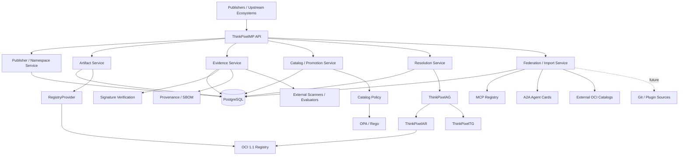

The defining architectural rule is:

> **ThinkPixelMP stores artifact identity, metadata, evidence, policy decisions, and catalog state. Artifact bytes remain in external standards-based registries.**

## Artifact model

ThinkPixelMP distinguishes:

- logical artifact identity;
- immutable artifact version;
- delivery mechanism;
- artifact kind;
- trust/evidence state;
- catalog eligibility;
- runtime authority.

These concepts must not be collapsed into one "installed plugin" object.

### Artifact

An **Artifact** is a logical named software/component identity.

Example:

```text
thinkpixel/security/secure-pr-reviewer
```

### ArtifactVersion

An **ArtifactVersion** is an immutable instance of an Artifact.

A human may identify it as:

```text
secure-pr-reviewer:2.4.1
```

but the authoritative identity is:

```text
sha256:...
```

Semantic versions and tags are discovery metadata.

The digest is identity.

### ArtifactSource

An ArtifactVersion records where it came from, such as:

- OCI registry;
- MCP Registry;
- A2A endpoint;
- Git repository;
- imported vendor catalog.

The source does not replace the immutable Marketplace identity.

### ArtifactRequirement

Artifacts may declare requirements such as:

```text
capabilities:
  scm.repository.read
  scm.pull_request.read

runtime:
  isolation-class = microvm-strong
  architecture = amd64
  memory >= 8 GiB

network:
  package-registry required
```

These are compatibility and policy inputs.

They are **not grants**.

### ArtifactDependency

Artifacts may depend on other artifacts.

Dependencies may initially be expressed using:

- exact digest;
- exact semantic version;
- bounded semantic-version range.

A production resolution always produces exact immutable digests.

### ArtifactLock

An **ArtifactLock** is the immutable resolved dependency graph.

For example:

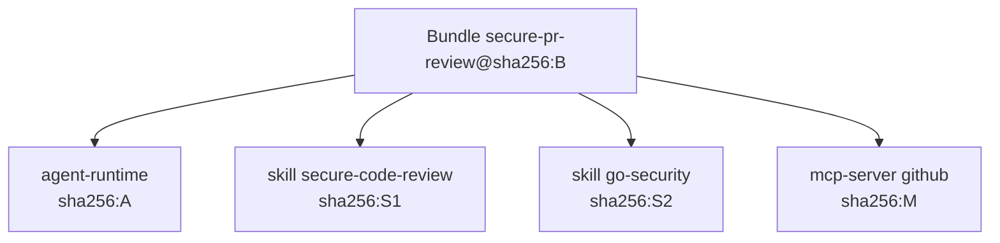

A lock graph is content-addressed and reproducible.

### ArtifactResolution

An **ArtifactResolution** is a durable Marketplace decision binding:

- root artifact;
- exact dependency lock;
- catalog context;
- policy context;
- relevant approval/evidence state;
- immutable resolution digest.

ThinkPixelAG should consume an ArtifactResolution rather than resolving mutable Marketplace names during every Run.

## Artifact kinds

### `skill`

Portable agent skills following the Agent Skills ecosystem model.

A skill may contain:

- `SKILL.md`;
- scripts;
- references;
- supporting assets.

ThinkPixelMP may package imported skills as OCI artifacts while preserving upstream provenance.

Loading a skill must never expand runtime authority.

### `agent-runtime`

An executable agent package intended for ThinkPixelAR or another compatible runtime.

The ThinkPixel runtime manifest may describe:

- immutable OCI image digest;
- HarnessAdapter kind;
- adapter compatibility;
- process entrypoint;
- Workspace mount;
- durable vendor state paths;
- architecture;
- abstract Runtime Profile requirements;
- capability requirements;
- network requirements.

Runtime metadata remains declarative.

An artifact cannot directly request Kubernetes privilege.

### `mcp-server`

An MCP server descriptor and distribution reference.

Delivery may be:

- OCI/containerized;
- remote endpoint;
- imported package metadata.

Marketplace availability does not automatically create a ThinkPixelTG tool integration.

An administrator must still onboard/configure the service into TG.

### `remote-agent`

A remote agent represented using an immutable A2A Agent Card snapshot.

Marketplace metadata may include:

- Agent Card;
- card digest;
- signature;
- endpoint;
- protocol version;
- declared skills;
- publisher;
- endpoint verification state.

Remote agents have fundamentally different assurance properties from local OCI artifacts.

ThinkPixelMP exposes those differences explicitly.

### `bundle`

A Bundle is a compositional artifact.

Example:

```yaml
apiVersion: marketplace.thinkpixel.io/v1alpha1
kind: Bundle

metadata:
  name: secure-pr-review

components:
  - kind: agent-runtime
    ref: mp://agents/codex-reviewer@2.3.1

  - kind: skill
    ref: mp://skills/secure-code-review@4.1.0

  - kind: skill
    ref: mp://skills/go-security@1.7.2

  - kind: mcp-server
    ref: mp://tools/github@3.0.0
```

Promotion/resolution converts these references to exact immutable digests.

Bundle selection does not grant the union of its dependencies' requested capabilities.

## OCI-native distribution

ThinkPixelMP uses OCI-compatible registries as the primary distribution substrate for local artifacts.

Conceptually:

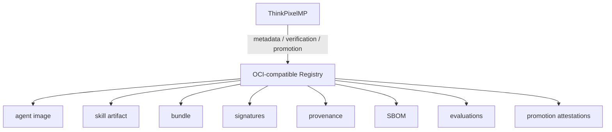

ThinkPixelMP does not implement registry blob storage.

A `RegistryProvider` adapter hides registry implementation details.

The first implementation is expected to use ORAS-compatible OCI tooling.

## OCI referrers and evidence

OCI referrers provide a natural way to associate evidence with immutable artifacts.

For example:

```mermaid
flowchart TB
    ART[agent-runtime@sha256:A] --> SIG[signature]
    ART --> PROV[provenance]
    ART --> SBOM[SPDX / CycloneDX SBOM]
    ART --> VULN[vulnerability scan]
    ART --> STATIC[static analysis]
    ART --> EVAL[agent evaluation]
    ART --> PROM[ThinkPixelMP promotion attestation]
```

PostgreSQL remains authoritative for normalized Marketplace evidence and promotion history.

OCI attachments provide portable supply-chain evidence.

## Publisher and namespace model

Publishers own namespaces.

For example:

```text
thinkpixel/*
acme/security/*
example-org/agents/*
```

A Publisher can represent:

- an organization;
- an individual;
- an automated build identity;
- an imported upstream identity.

Publisher state may distinguish:

```text
claimed
verified
suspended
revoked
```

Publisher verification means:

> ThinkPixelMP has evidence that this identity controls the claimed namespace.

It does **not** mean:

> Every artifact published by this identity is secure.

Namespace verification, artifact authenticity, security evidence, and organization approval remain separate.

## Supply-chain evidence

ThinkPixelMP intentionally avoids one generic trust score.

Instead, trust is represented through independent evidence.

### Publisher verification

Answers:

> Who controls this namespace?

### Signature verification

Answers:

> Did this trusted identity sign this exact digest?

A valid signature does not automatically imply that Marketplace policy trusts the signer.

### Provenance

Answers:

> Where did this artifact come from and how was it produced?

SLSA-compatible provenance should be preserved where available.

### SBOM

ThinkPixelMP supports metadata for standard formats such as:

- SPDX;
- CycloneDX.

### Vulnerability evidence

External scanners may provide evidence such as:

```text
scanner
scanner version
vulnerability database revision
scan timestamp
severity summary
finding references
```

ThinkPixelMP stores normalized results and artifact-bound evidence.

It does not need to implement the scanner itself.

### Malware and static-analysis evidence

External analysis systems may publish signed evidence attached to exact artifact digests.

### License evidence

Marketplace policy can consume detected-license information and organization license rules.

### Agent-evaluation evidence

Agent behavior/evaluation systems can publish:

```text
artifact digest
evaluation definition
evaluation version
evaluator identity
timestamp
result
```

ThinkPixelMP consumes the evidence.

It does not need to become the evaluation engine.

### Human review

Human approvals remain first-class evidence rather than being hidden inside one global boolean.

## Evidence model

Every EvidenceRecord is bound to an exact artifact digest.

Conceptually:

```text
EvidenceRecord

  subject:
    sha256:ABC

  type:
    vulnerability-scan

  producer:
    scanner.example/trivy

  producer_version:
    x.y.z

  observed_at:
    ...

  evidence_digest:
    sha256:...

  result:
    ...

  verification:
    trusted
```

The invariant is:

```text
Evidence(sha256:A) cannot qualify sha256:B
```

even if both artifacts use the same semantic version label.

Publisher self-claims remain declarations unless the publisher is explicitly trusted as the producer of that evidence type.

## Catalogs

Catalogs represent organization-specific eligibility contexts.

Examples:

```text
experimental
engineering
security
production
finance-approved
airgap-approved
```

The same exact artifact digest can belong to several catalogs or be permitted in one and rejected in another.

For example:

```text
secure-reviewer@sha256:A

experimental:
  allowed

engineering:
  allowed

production:
  denied
```

Catalog membership is separate from artifact lifecycle.

## Promotion

Promotion is explicit and auditable.

A typical production promotion may require:

```text
verified publisher
AND trusted signature
AND verified provenance
AND SBOM available
AND no critical vulnerabilities
AND allowed license
AND security evaluation passed
AND two human reviewers
```

The result means:

> This exact artifact digest is eligible in this catalog.

It does **not** mean:

> Any user or agent may execute it.

ThinkPixelAG decides runtime authorization separately.

### Four-eyes approval

Protected catalogs may require multiple independent reviewers.

A principal cannot satisfy two separate reviewer requirements merely by submitting two identical approvals.

Promotion records preserve:

- requester;
- reviewers;
- exact digest;
- dependency lock;
- evidence snapshot;
- policy version;
- decision;
- reason;
- timestamp.

## Policy

ThinkPixelMP separates two different policy concerns.

### Marketplace administration policy

Controls actions such as:

- creating namespaces;
- publishing versions;
- administering catalogs;
- configuring federation;
- submitting trusted evidence;
- reviewing promotions;
- revoking artifacts.

### Catalog eligibility policy

Controls whether an exact artifact may enter a catalog.

Catalog policy can consume:

- publisher verification;
- signature state;
- provenance;
- SBOM;
- vulnerability results;
- license;
- evaluation results;
- review evidence;
- dependency state;
- evidence freshness.

OPA/Rego is the preferred reference implementation for catalog policy.

Protected promotion fails closed when required policy/evidence cannot be evaluated safely.

## Deprecation, quarantine, and revocation

These states are intentionally distinct.

### Deprecation

Means:

> Avoid new usage.

Existing usage may remain acceptable according to AG/operator policy.

A deprecated artifact may point to a recommended replacement.

### Quarantine

Means:

> Temporarily exclude from trusted resolution while investigation is in progress.

Quarantine preserves full history.

### Revocation

Means:

> This exact digest is known or considered unsafe/untrusted.

Revocation is append-only historical evidence.

Revoked artifacts are not deleted.

A revocation may contain:

```text
artifact digest
reason
severity
effective timestamp
replacement digest
evidence references
```

ThinkPixelMP emits revocation events.

ThinkPixelAG decides how those events affect:

- future Run admission;
- existing approved resolutions;
- active Runs;
- AR Sessions.

ThinkPixelMP itself does not kill running agents.

## Dependency resolution

Agentic artifacts are compositional, so deterministic dependency resolution is part of Marketplace correctness.

Resolution checks include:

- dependency cycles;
- missing dependencies;
- incompatible version ranges;
- revoked dependencies;
- catalog-ineligible dependencies;
- invalid kind relationships;
- source ambiguity;
- dependency confusion;
- unresolved mutable references.

Production resolution always produces exact digests.

No runtime execution should depend on:

```text
latest
2.x
main
HEAD
```

as its final artifact identity.

## No silent updates

Suppose Marketplace contains:

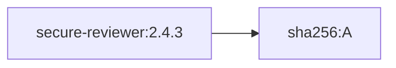

and upstream publishes:

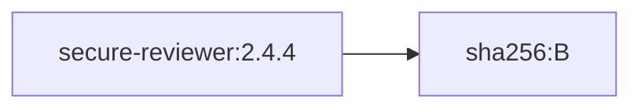

ThinkPixelMP does not silently replace A with B.

Instead:

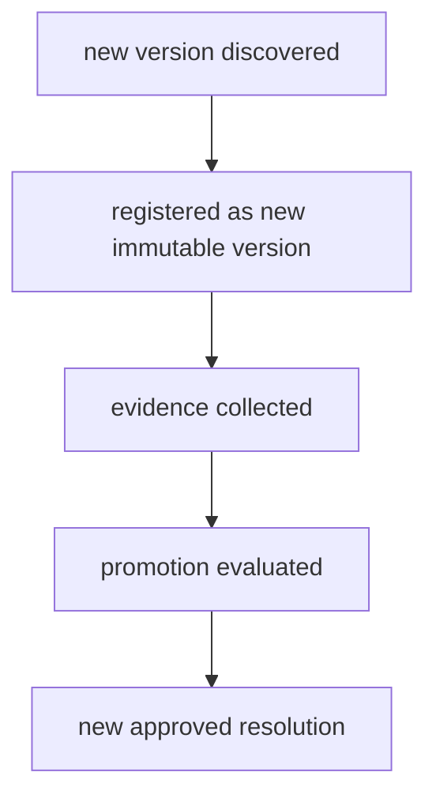

Existing resolutions remain reproducible.

## Federation

ThinkPixelMP is intended to aggregate and curate existing ecosystems rather than replace them.

Potential upstream sources include:

- official MCP Registry;
- external OCI registries;
- vendor/community catalogs;
- A2A Agent Cards;
- future Agent Skill/plugin repositories.

The federation model is:

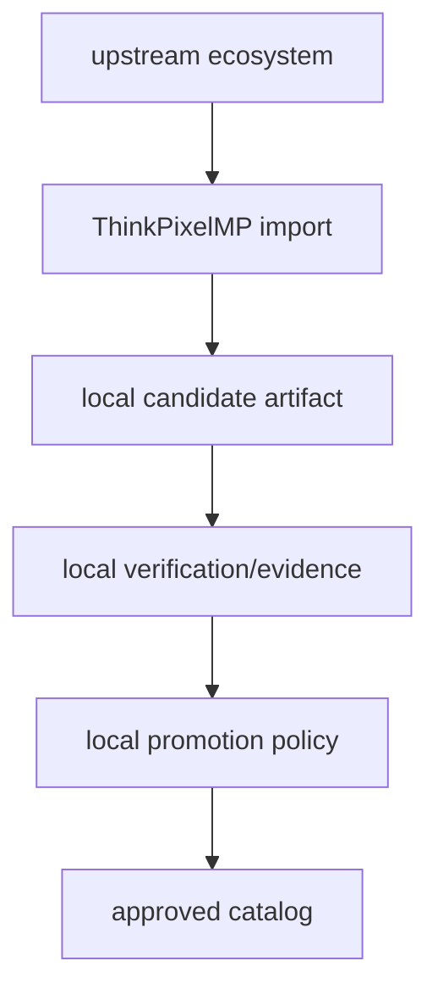

Import never automatically means approval.

## MCP Registry integration

The official MCP Registry is treated as an upstream metadata source.

ThinkPixelMP may import:

- server identity;
- descriptor;
- package/distribution information;
- remote endpoint metadata.

The imported entry remains a candidate until local organization policy qualifies it.

ThinkPixelMP does not replace the MCP Registry.

ThinkPixelTG remains responsible for live MCP/tool governance.

## Remote agents and A2A

Remote agents are represented using A2A Agent Cards where practical.

A remote service cannot provide the same assurance evidence as a locally inspected OCI artifact.

For example:

```text
Local OCI agent

publisher verified       yes
signature verified       yes
SBOM                      yes
vulnerability scan       yes
runtime isolation        organization-controlled
```

versus:

```text
Remote A2A agent

publisher verified       maybe
Agent Card signature     maybe
endpoint verified        yes
implementation SBOM      maybe unavailable
runtime isolation        provider-controlled
```

ThinkPixelMP exposes these assurance differences rather than flattening both to a generic "verified" badge.

## Imported artifacts

Some ecosystems may not publish OCI artifacts directly.

ThinkPixelMP may eventually snapshot/repackage them into OCI.

For example:

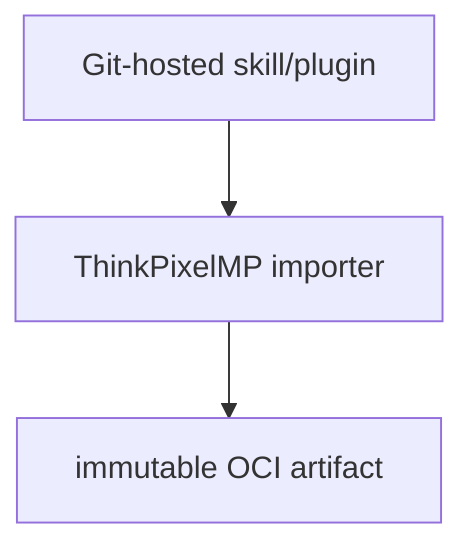

The resulting provenance must retain:

```text
original publisher
original source repository
source commit
importer identity/version
import timestamp
resulting OCI digest
```

ThinkPixelMP must never imply that the original publisher created or signed the repackaged OCI artifact unless they actually did.

## Safe artifact inspection

Artifact contents are hostile input.

ThinkPixelMP must not execute arbitrary artifact code merely to inspect it.

Static inspection must enforce limits for:

- manifest size;
- layer count;
- file count;
- compressed size;
- uncompressed size;
- decompression ratio;
- parsing time;
- media type;
- path traversal;
- absolute paths;
- symlink/hardlink escape;
- device/special files;
- malformed structured metadata.

Artifact scripts, hooks, binaries, or entrypoints are not executed during Marketplace registration.

## SSRF protection

Federation and remote-service verification can create server-side request forgery risk.

All remote fetching should use one hardened policy-controlled mechanism.

It must defend against:

- loopback targets;
- link-local addresses;
- cloud metadata endpoints;
- Kubernetes/service networks;
- restricted private ranges;
- unsafe redirects;
- DNS/address switching;
- oversized responses;
- invalid content types;
- credential forwarding across origin changes;
- TLS verification failure.

Remote descriptors are data, not trusted instructions.

## Search and discovery

ThinkPixelMP supports marketplace browsing across attributes such as:

- artifact name;
- namespace;
- publisher;
- artifact kind;
- catalog;
- semantic version;
- digest;
- description;
- tags/categories;
- required capabilities;
- runtime requirements;
- lifecycle;
- evidence state.

Search is a discovery mechanism.

It is not authoritative artifact resolution.

A user interface may search:

```text
latest secure code reviewer
```

but AG/runtime integration ultimately receives:

```text
sha256:...
```

Hybrid lexical/semantic search may be added later without changing identity or promotion semantics.

## ThinkPixelAG integration

ThinkPixelAG consumes immutable Marketplace resolutions.

A typical flow is:

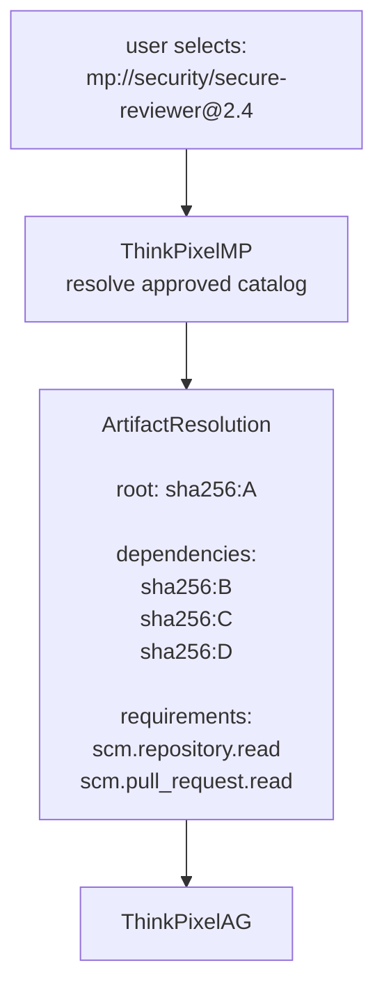

AG then independently decides:

- whether the principal may use the artifact;
- whether the agent/version is allowed;
- which requested capabilities are actually granted;
- which resources/budgets apply;
- whether Run admission succeeds.

The invariant is:


AG should persist the exact resolved artifact digests on the Run.

## ThinkPixelAR integration

ThinkPixelAR does not browse the Marketplace during normal execution.

By execution time, discovery and authorization should already be complete.

Preferred flow:

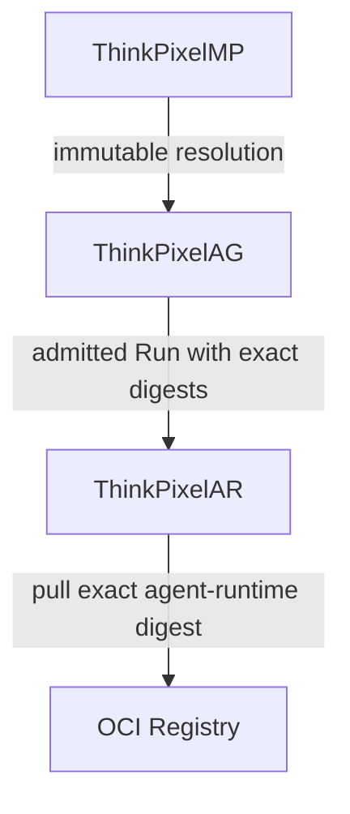

AR should verify the actual digest it materializes.

It must never execute:

```text
agent:latest
```

because Marketplace resolution happened to use that friendly label.

## ThinkPixelTG integration

An MCP server appearing in ThinkPixelMP means:

> This artifact is discoverable and has Marketplace evidence.

It does not mean:

> Agents can now invoke it.

A typical integration is:

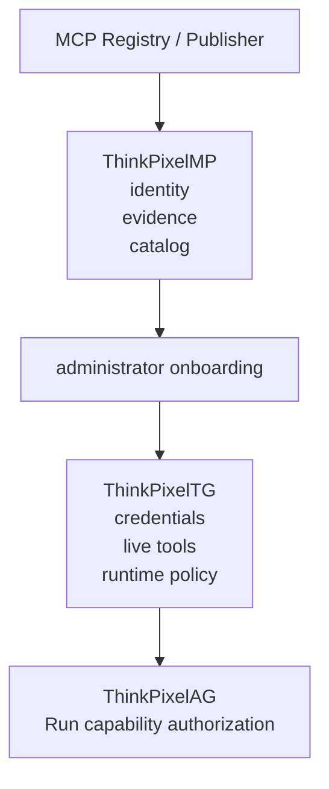

Marketplace installation or catalog membership cannot create downstream credentials.

## Runtime authority boundary

ThinkPixelMP never grants runtime authority.

For example, an artifact may declare:

```yaml
requires:
  capabilities:
    - github.repository.read
    - github.pull_request.read

optional:
  capabilities:
    - github.pull_request.comment
```

ThinkPixelMP records and displays those requirements.

ThinkPixelAG may later authorize only:

```text
github.repository.read
github.pull_request.read
```

The optional comment capability remains unavailable.

Installing or approving the artifact does not change that.

## Marketplace metadata cannot configure privileged runtime state

An artifact may say:

```text
requires:
  sandbox: strong
  memory: 8Gi
  package-registry: required
```

It may not directly cause:

```text
privileged container
host network
hostPath mount
cluster-admin service account
secret injection
unrestricted egress
```

Those decisions belong to trusted runtime policy in ThinkPixelAG/ThinkPixelAR/operator configuration.

The rule is:

> **Artifacts declare requirements. Trusted control-plane components decide how, or whether, to satisfy them.**

## API contract

The initial public API uses REST/JSON with OpenAPI 3.1.

Expected API areas include:

### Discovery

```text
GET /v1/artifacts
GET /v1/artifacts/{artifact_id}
GET /v1/artifacts/{artifact_id}/versions
GET /v1/artifact-versions/{version_id}

GET /v1/publishers
GET /v1/namespaces

GET /v1/catalogs
GET /v1/catalogs/{catalog_id}
GET /v1/catalogs/{catalog_id}/entries
```

### Publication

```text
POST /v1/publishers
POST /v1/namespaces
POST /v1/artifacts
POST /v1/artifacts/{artifact_id}/versions
```

### Evidence

```text
GET  /v1/artifact-versions/{version_id}/evidence
POST /v1/artifact-versions/{version_id}/evidence
```

Trusted evidence producers may use separately authorized write routes.

### Promotion

```text
POST /v1/catalogs/{catalog_id}/promotion-requests
GET  /v1/promotion-requests/{id}
POST /v1/promotion-requests/{id}/reviews
POST /v1/promotion-requests/{id}/decide
```

### Resolution

```text
POST /v1/resolutions
GET  /v1/resolutions/{resolution_id}
```

### Lifecycle

```text
POST /v1/artifact-versions/{id}/deprecate
POST /v1/artifact-versions/{id}/quarantine
POST /v1/artifact-versions/{id}/revoke
```

### Federation

Administrative APIs may include:

```text
/v1/import-sources
/v1/import-runs
```

### Events

```text
GET /v1/events
```

Mutation endpoints use scoped `Idempotency-Key` semantics.

Errors use RFC 7807 problem details.

Identity and tenant ownership derive from authenticated context, not untrusted request fields.

## Marketplace events

ThinkPixelMP emits ordered security/supply-chain events such as:

- artifact registered;
- evidence added;
- evidence expired;
- promotion requested;
- artifact promoted;
- artifact deprecated;
- artifact quarantined;
- artifact revoked;
- import completed;
- import failed.

Events are useful for:

- ThinkPixelAG;
- SIEM;
- security data lake;
- notifications;
- internal automation.

Delivery is expected to use a transactional outbox with at-least-once semantics and stable event IDs.

## Persistence

PostgreSQL is authoritative for Marketplace control metadata including:

- Publishers;
- Namespaces;
- Artifacts;
- immutable ArtifactVersions;
- sources;
- descriptors;
- requirements;
- dependencies;
- ArtifactLocks;
- ArtifactResolutions;
- evidence metadata;
- Catalogs;
- promotion workflows;
- policy references;
- lifecycle state;
- deprecation;
- quarantine;
- revocation;
- federation/import state;
- remote endpoint state;
- audit events;
- idempotency records;
- transactional outbox.

Artifact blobs do not live in PostgreSQL.

Large raw evidence reports may live in OCI/object storage while PostgreSQL retains normalized summaries and exact references.

## Catalog snapshots and air-gapped environments

ThinkPixelMP is intended to support disconnected environments.

A future/extended catalog snapshot may contain:

- exact catalog membership;
- immutable artifact digests;
- dependency locks;
- evidence digests;
- promotion evidence;
- revocations;
- policy references.

The snapshot itself may be distributed as a signed OCI artifact.

Conceptually:

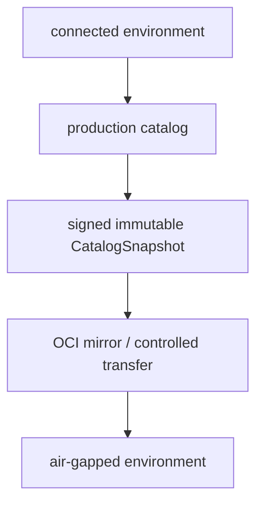

The same exact artifact identities and evidence can therefore be promoted across environments without depending on a centralized SaaS marketplace.

## Security model

ThinkPixelMP assumes the following may be hostile:

- artifact publishers;
- OCI metadata;
- OCI manifests;
- OCI layers;
- imported Git repositories;
- skill scripts;
- MCP descriptors;
- Agent Cards;
- remote endpoints;
- dependency metadata;
- third-party evidence payloads;
- SBOMs;
- provenance documents.

Existence in a registry is not trust.

### Registry credentials

Registry credentials are operator-managed.

Artifacts cannot specify which high-privilege credential MP should use.

Credentials are:

- scoped per registry/repository;
- least privilege;
- independently rotatable;
- excluded from API responses;
- redacted from telemetry.

### Dependency confusion

Dependency resolution uses explicit configured sources and catalogs.

Missing private artifacts must not silently resolve from arbitrary public namespaces.

### Evidence spoofing

Only trusted evidence producers can create trusted evidence categories.

A publisher submitting:

```text
vulnerability-scan = passed
```

does not make that field equivalent to authenticated scanner evidence.

### Historical integrity

Registered immutable versions, completed resolutions, promotions, and revocations must remain auditable.

Security history is not rewritten for convenience.

## Security and reliability principles

- Treat artifact metadata and contents as hostile input.
- Never execute untrusted artifact code during Marketplace inspection.
- Resolve mutable tags to immutable digests immediately.
- Never mutate an existing ArtifactVersion to point to new content.
- Bind signatures, evidence, approvals, and revocations to exact digests.
- Keep publisher identity separate from Marketplace approval.
- Keep Marketplace eligibility separate from runtime authority.
- Keep artifact requirements separate from capability grants.
- Keep artifact requirements separate from privileged infrastructure configuration.
- Require trusted evidence-producer identities.
- Fail closed for protected catalog promotion when required evidence or policy cannot be evaluated.
- Preserve revocation history permanently.
- Distinguish deprecation, quarantine, and revocation.
- Make dependency resolution deterministic and reproducible.
- Prevent dependency confusion through explicit sources/catalogs.
- Protect all federation/remote fetching against SSRF.
- Keep registry credentials and signing material out of Marketplace metadata and telemetry.
- Keep MP out of the runtime hot path once AG has durably captured an immutable approved resolution.
- Prefer existing open standards to ThinkPixel-specific formats wherever practical.

## Repository layout

The planned repository layout is:

```text
cmd/
  thinkpixelmp/              Marketplace API/control plane
  migrate/                   PostgreSQL migration command
  thinkpixelmpctl/           Marketplace CLI

api/
  openapi/                   REST API specification
  schemas/                   artifact/evidence schemas

internal/
  domain/
    publisher/
    artifact/
    evidence/
    catalog/
    promotion/
    resolution/
    revocation/

  app/
    publication/
    discovery/
    evidence/
    promotion/
    resolution/
    federation/

  ports/
    registry/
    signature/
    provenance/
    evidence/
    policy/
    identity/
    importer/
    key/
    clock/

  adapters/
    registry/
      oras/

    signature/
      sigstore/

    policy/
      opa/

    import/
      mcpregistry/
      oci/
      a2a/
      git/

    postgres/
    http/
    oidc/
    key/

  telemetry/
  security/

migrations/

deploy/
  helm/

docs/
  adr/
  contracts/
  supported-versions.md

test/
  integration/
  contract/
  security/
  federation/
  e2e/

Dockerfile
Makefile
PLAN.md
TODO.md
```

The core dependency rule is:

> `internal/domain` must not import ORAS, Sigstore/Cosign, OPA, PostgreSQL drivers, HTTP frameworks, MCP Registry client types, A2A implementation types, Kubernetes types, or ThinkPixelAG transport types.

Those systems are adapters.

## CLI

`thinkpixelmpctl` is intended to support developer/operator workflows such as:

```text
thinkpixelmpctl artifact inspect
thinkpixelmpctl artifact register
thinkpixelmpctl artifact get

thinkpixelmpctl evidence list

thinkpixelmpctl catalog list
thinkpixelmpctl catalog resolve

thinkpixelmpctl promotion request
thinkpixelmpctl promotion review

thinkpixelmpctl artifact deprecate
thinkpixelmpctl artifact revoke

thinkpixelmpctl import run
```

The CLI uses the public API rather than bypassing Marketplace policy through direct database access.

## Development workflow

The repository-root Makefile is the stable developer and CI interface.

Expected targets include:

```text
make tools
make generate
make fmt
make lint
make test
make test-race
make test-integration
make test-contract
make test-security
make test-federation
make test-e2e
make build
make image
make verify
```

Integration tests use disposable PostgreSQL, OCI registry, policy, and federation fixtures.

Tests must never target production registries or production Marketplace installations.

## Testing strategy

ThinkPixelMP is fundamentally a software-supply-chain and policy-control system.

Testing therefore focuses heavily on immutability, hostile input, provenance, evidence integrity, and deterministic resolution.

The release suite will include:

- domain/unit tests;
- race tests;
- property/fuzz tests;
- PostgreSQL integration tests;
- disposable OCI registry tests;
- signature verification tests;
- provenance/SBOM tests;
- evidence producer spoofing tests;
- policy tests;
- promotion concurrency tests;
- dependency resolution tests;
- hostile archive/OCI tests;
- SSRF/federation security tests;
- ThinkPixelAG integration tests;
- revocation propagation tests;
- complete end-to-end supply-chain scenarios.

Hostile artifact tests should attempt:

```text
mutable tag substitution
digest mismatch
path traversal
symlink escape
decompression bomb
oversized manifest
malicious OCI referrers
invalid media types
dependency confusion
forged scanner evidence
namespace takeover
SSRF through remote descriptor
credential exfiltration through redirects
privileged runtime fields in artifact metadata
```

The expected result is deterministic infrastructure rejection or neutralization.

## Reference MVP scenario

The reference end-to-end use case is publication of a coding-agent runtime.

A publisher creates:

```text
acme/security/secure-reviewer
```

and publishes:

```text
secure-reviewer:2.4.1
```

ThinkPixelMP resolves:

```mermaid
flowchart TB
    TAG[registry.example/acme/secure-reviewer:2.4.1] --> DIGEST[registry.example/acme/secure-reviewer@sha256:ABC]
```

Then MP:

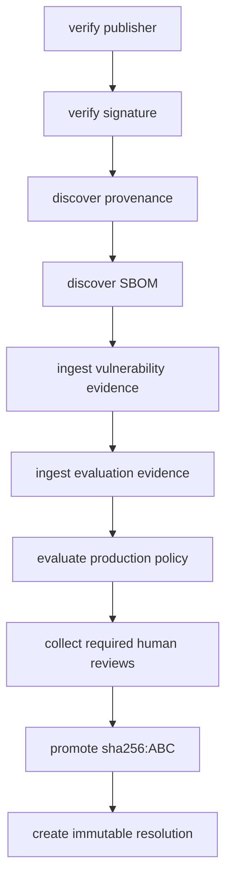

ThinkPixelAG receives:

```text
resolution:
  agent-runtime = sha256:ABC

declared requirements:
  scm.repository.read
  scm.pull_request.read
```

AG separately decides whether a particular user/Run actually receives those capabilities.

ThinkPixelAR then executes exactly:

```text
sha256:ABC
```

Later, a security issue is discovered.

ThinkPixelMP records:

```text
sha256:ABC
  REVOKED
```

and emits a revocation event.

ThinkPixelAG applies runtime revocation policy.

The original ArtifactVersion, evidence, promotion history, and audit trail remain preserved.

## Observability

ThinkPixelMP uses:

- structured logs;
- Prometheus metrics;
- OpenTelemetry traces.

Useful correlation fields include:

```text
tenant
publisher_id
artifact_id
artifact_version_id
artifact_digest
catalog_id
promotion_request_id
resolution_id
import_source_id
request_id
trace_id
```

Initial metrics should cover:

- artifact registrations;
- registration failures;
- registry resolution latency;
- signature-verification latency/failure;
- descriptor-validation failures;
- evidence ingestion;
- stale evidence;
- promotion requests/results;
- policy evaluation latency/failure;
- catalog entries;
- dependency-resolution failures;
- revocations;
- federation imports;
- endpoint verification;
- outbox lag;
- PostgreSQL pool health;
- API request rate/error/latency.

Telemetry must not automatically contain:

- registry credentials;
- signing keys;
- private artifact payloads;
- unbounded SBOM/evidence contents;
- proprietary source code.

## Configuration and deployment

The first supported deployment target is Kubernetes, but ThinkPixelMP itself is not Kubernetes-specific.

Production deployments are expected to provide:

- PostgreSQL;
- one or more OCI registries;
- OIDC/JWT identity;
- TLS;
- catalog policy configuration;
- signature trust policy;
- registry credentials through secret references;
- optional OPA;
- optional external scanners/evaluators;
- optional federation sources.

Kubernetes deployments should use:

- non-root containers;
- read-only root filesystem where practical;
- dropped Linux capabilities;
- seccomp;
- explicit CPU/memory limits;
- NetworkPolicies;
- minimal RBAC;
- migration Job before rollout;
- disruption controls.

The exact supported Go, PostgreSQL, OCI Distribution, ORAS, Sigstore/Cosign, OPA, MCP, A2A, and related versions will be maintained in `docs/supported-versions.md`.

## Release-candidate definition

ThinkPixelMP reaches release-candidate state when:

- immutable Artifact and ArtifactVersion identity is implemented;
- Publisher and Namespace ownership are enforced;
- OCI artifact registration is proven against a disposable registry;
- mutable tags cannot alter existing Marketplace identity;
- Agent Skill, agent-runtime, MCP, Bundle, and required remote-artifact schemas are validated;
- artifact inspection does not execute untrusted code;
- signature verification works against exact digests;
- provenance and SBOM evidence are supported;
- trusted evidence-producer identity is enforced;
- production catalog policy fails closed;
- promotion is auditable and supports required reviewer separation;
- dependency resolution is deterministic;
- ArtifactLocks contain only immutable references;
- ArtifactResolutions are immutable;
- contextual catalog approval works;
- deprecation, quarantine, and revocation are distinct;
- revocation history remains intact;
- hostile OCI/archive tests pass;
- SSRF/federation security tests pass;
- ThinkPixelAG consumes exact immutable resolutions;
- Marketplace metadata cannot grant AG capability authority;
- ThinkPixelAG receives digest revocation signals;
- temporary MP unavailability does not become an unnecessary runtime hot-path dependency;
- production deployment/backup/upgrade procedures are tested;
- all required `TODO.md` items are complete.

The defining RC proof is:

> **An enterprise can discover an untrusted upstream agentic artifact, bind it to an immutable digest, verify its publisher and supply-chain evidence, evaluate organization policy, promote it into an approved catalog, resolve an immutable dependency graph for ThinkPixelAG, and later revoke the exact digest without ever turning Marketplace metadata into runtime authority.**

At release-candidate closure, durable architectural decisions and implementation lessons are transferred into `docs/adr/`, planning documents are retired, and release artifacts are produced from one exact commit.

## Roadmap after the first release

Potential post-RC work includes:

- richer MCP Registry federation;
- Claude/OpenAI plugin import;
- general Git-hosted Agent Skill import;
- npm/PyPI discovery profiles where useful;
- public multi-organization marketplace operation;
- web marketplace UI;
- ratings/reviews and abuse moderation;
- commercial licensing/billing;
- hybrid lexical/semantic artifact search;
- recommendations;
- cross-enterprise trust federation;
- richer A2A agent discovery;
- signed public catalog feeds;
- transparency-log integration;
- automated replacement/remediation suggestions;
- dependency-impact analysis for vulnerabilities;
- richer compatibility analysis against ThinkPixelAR Runtime Profiles;
- evaluation-orchestration integrations;
- public ThinkPixel community catalog if ecosystem demand justifies it.

These extensions must preserve the fundamental separation between:

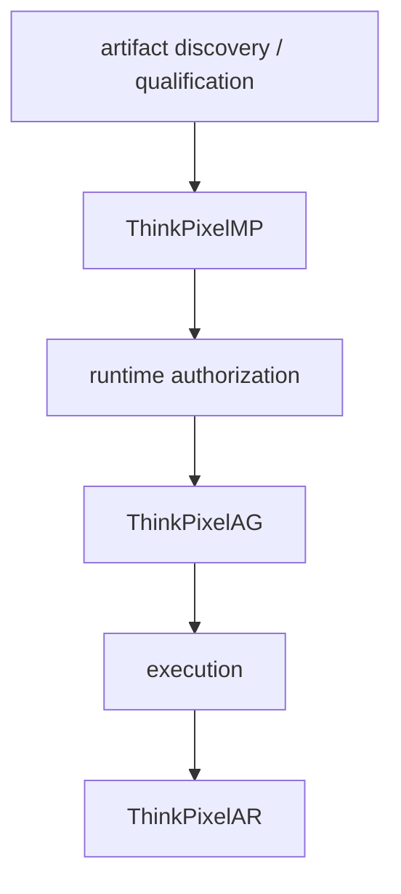

## License

Licensed under the terms in `LICENSE`.
