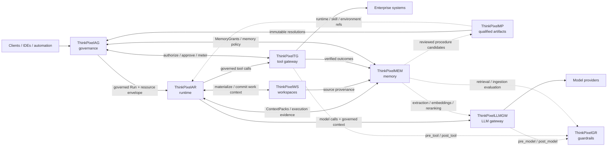

# ThinkPixelMP

ThinkPixelMP is an open-source, vendor-neutral marketplace and software supply-chain control plane for AI agents and agentic artifacts.

It provides discovery, immutable artifact identity, OCI-compatible distribution metadata, publisher verification, provenance, security and evaluation evidence, dependency resolution, catalog curation, controlled promotion, federation, and digest-level revocation.

> **ThinkPixelMP qualifies software. ThinkPixelAG authorizes behavior. ThinkPixelAR executes it.**

Marketplace availability and artifact requirements are not runtime authority. Artifact bytes remain in standards-compatible OCI registries; MP owns the trusted metadata, evidence, curation, and immutable-resolution layer around them.

## Status

ThinkPixelMP is in active implementation. The current codebase establishes the Go module and package boundaries, versioned OpenAPI and JSON Schema contracts, typed configuration, structured logging, and Phase 0 architecture evidence. [`PLAN.md`](PLAN.md) defines implementation intent and [`TODO.md`](TODO.md) is the ordered delivery ledger.

## Quick start

Requirements:

- Go 1.26.0 or a compatible toolchain;
- Node.js and npm for OpenAPI validation;
- `jq` for JSON Schema syntax validation.
- Docker with Compose for the disposable PostgreSQL development dependency.

Install the pinned contract tooling and run the aggregate repository gate:

```sh
npm ci
make verify
```

Run `make help` for the stable developer/CI command surface. It includes generation,
formatting, static analysis, focused test-suite, contract, dependency, aggregate
verification, and image entry points. Targets whose implementation belongs to a
later checklist item fail with an actionable message until that item is complete.

Set a disposable `TPMP_POSTGRES_PASSWORD`, then run `make postgres-up` to start the
pinned local database and `make migrate` to use the explicit migration entry point. See
[`docs/operations/development-database.md`](docs/operations/development-database.md).

Use `go run ./cmd/thinkpixelmpctl live` to query the local service through its
HTTP API. See [`docs/operations/cli.md`](docs/operations/cli.md) for endpoint and
credential configuration.

## Key concepts

- An **Artifact** is a tenant-scoped logical identity; an **ArtifactVersion** is identified authoritatively by an immutable digest.
- Signatures, provenance, SBOMs, scans, evaluations, and reviews remain distinct digest-bound evidence categories.
- Catalog membership records policy-controlled eligibility. It does not authorize a Run or grant a declared capability.
- Protected resolution produces an immutable, signed artifact graph for a consumer such as ThinkPixelAG.
- Deprecation, quarantine, and revocation are separate lifecycle states; revocation is append-only.
- Publisher metadata and imported content are hostile input and cannot select credentials or privileged infrastructure.

## Documentation

- [`ALIGNMENT.md`](ALIGNMENT.md) — repository ownership and ThinkPixel family boundaries.
- [`docs/README.md`](docs/README.md) — normative documentation index.
- [`docs/adr/`](docs/adr/) — accepted architectural decisions.
- [`docs/contracts/`](docs/contracts/) and [`api/`](api/) — human-readable and machine-readable contracts.
- [`docs/architecture/`](docs/architecture/) — system context, trust boundaries, and persistence model.
- [`docs/security/`](docs/security/) — invariants, threat model, and hostile-input controls.
- [`docs/operations/`](docs/operations/) — configuration, logging, and service objectives.
- [`docs/evidence/`](docs/evidence/) — implementation and verification evidence.

## ThinkPixel platform

This project is part of the **ThinkPixel** family: a modular, vendor-neutral set of components for building governed enterprise AI-agent platforms.

Each component is independently useful. The complete platform is a composition of replaceable services connected through versioned contracts; no component requires the full stack in order to be deployed.

| Component | Role |
|---|---|
| [ThinkPixelAG](https://github.com/bdobrica/ThinkPixelAG) | Agent governance and lifecycle control plane: agent/run authority, policy decisions, resource envelopes, approvals, revocation, and trusted governance state. |
| [ThinkPixelAR](https://github.com/bdobrica/ThinkPixelAR) | Agent runtime: durable Sessions, isolated/disposable execution, harness adaptation, recovery, and runtime events. |
| [ThinkPixelWS](https://github.com/bdobrica/ThinkPixelWS) | Durable roaming Workspaces: persistent work context, immutable generations, materializations, snapshots, forks, and source provenance. |
| [ThinkPixelMEM](https://github.com/bdobrica/ThinkPixelMEM) | Long-term agent memory: governed learned context, provenance, temporal revisions, retrieval, correction, and forgetting. |
| [ThinkPixelMP](https://github.com/bdobrica/ThinkPixelMP) | Marketplace and software supply-chain plane for Skills, runtimes, MCP servers, agent bundles, and other immutable agentic artifacts. |
| [ThinkPixelTG](https://github.com/bdobrica/ThinkPixelTG) | Tool gateway and policy-enforcement point for governed tool calls, downstream credentials, side effects, idempotency, and tool evidence. |
| [ThinkPixelLLMGW](https://github.com/bdobrica/ThinkPixelLLMGW) | LLM gateway for provider abstraction, model routing, credentials, budgets, accounting, and model-access policy enforcement. |
| [ThinkPixelGR](https://github.com/bdobrica/ThinkPixelGR) | Guardrails evaluator for model, tool, retrieval, and ingestion content. It returns findings/decisions; the calling gateway or service enforces them. |

### Intended composition



The diagram describes the **target integration model**, not a claim that every edge is implemented in every current release.

### Integration rules

The platform follows a few cross-component rules:

- **Authority does not emerge from content.** Marketplace metadata, Skills, Workspace membership, retrieved memory, model output, or a guardrail `allow` decision cannot grant permissions that the governed Run does not already have.
- **State has one authoritative owner.** Components exchange references and versioned messages; they do not read or write another component's database directly.
- **Integrations are adapters, not domain dependencies.** A ThinkPixel integration should be configurable and replaceable with a contract-compatible alternative.
- **Cross-component identity is explicit.** Where relevant, requests should carry stable governed context such as tenant, principal, agent, Run, Session/Workspace references, immutable artifact digests, and trace context.
- **Public integration contracts are versioned.** OpenAPI/JSON Schema/protobuf or another explicit wire contract is preferred over importing another repository's internal types.
- **Vendor-specific behavior stays behind adapters.** Model providers, agent harnesses, storage systems, registries, policy engines, and execution substrates must not become platform-wide domain contracts.

### Planned integration points

| Integration | Intended contract |
|---|---|
| **AG → AR** | AG admits a Run and supplies its authority/resource context; AR executes it and must not enlarge that authority. Revocation, lease, and fencing state flow back into runtime enforcement. |
| **MP → AG / AR / WS** | MP resolves qualified artifacts to immutable identities/digests. AG decides whether they may be used; AR/WS consume the resolved runtime, Skill, or environment references. Qualification is not authorization. |
| **AR ↔ WS** | AR materializes a durable Workspace generation into disposable execution and returns committed/checkpointed work to WS. Session identity remains owned by AR; Workspace identity remains owned by WS. |
| **AR → LLMGW** | Agent model calls go through LLMGW with governed Run/tenant context. Provider credentials and provider-specific routing stay outside the harness. |
| **LLMGW ↔ GR** | LLMGW will support an optional configured GR endpoint/profile mapping. It invokes `pre_model` before provider dispatch and `post_model` before releasing model output, then enforces GR's decision/transformation. GR remains optional and replaceable; its wire API is the contract. |
| **AR → TG** | Harness tool calls cross TG rather than reaching governed enterprise systems directly. TG owns credential brokerage, idempotency/side-effect handling, and trusted tool evidence. |
| **TG ↔ AG** | TG asks AG (or a contract-compatible authorizer) whether the current governed Run may perform the exact operation and obtains action-scoped approval when required. TG returns trusted metering/evidence. |
| **TG ↔ GR** | TG invokes `pre_tool` and `post_tool` evaluation when configured and enforces the result. A GR allow never overrides an AG authorization denial. |
| **AR / WS / TG → MEM** | Execution history, Workspace provenance, and verified tool outcomes may become evidence for learned memory. MEM does not become the source of truth for those upstream systems. |
| **AG ↔ MEM** | AG supplies Run-scoped memory authority (for example MemoryGrants); MEM enforces it for reads/writes and returns structured ContextPacks. |
| **MEM ↔ LLMGW / GR** | MEM may use LLMGW for extraction/embedding/reranking and GR for ingestion/retrieval inspection while keeping canonical memory state independent from either service. |
| **MEM → MP** | Learned procedure candidates may be reviewed and promoted through MP into qualified reusable Skills; learning does not silently become trusted executable behavior. |

Project-specific implementation status, supported versions, and release qualification belong in each project's own documentation.

## License

Licensed under the terms in [`LICENSE`](LICENSE).
