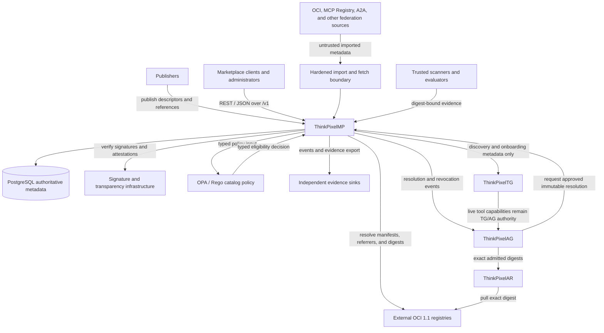

# System context

ThinkPixelMP is the metadata, trust, evidence, curation, and immutable-resolution control plane around external artifact stores and evidence producers.

## Ownership summary

| Component | Authoritative for | Not authoritative for |
| --- | --- | --- |
| ThinkPixelMP | Artifact identity, normalized evidence, catalog eligibility, promotion, immutable resolution, digest revocation | Run authorization, runtime privilege, live tool credentials, artifact bytes |
| PostgreSQL | Durable MP control-plane state | OCI payload storage |
| OCI registry | Addressed artifact bytes and registry manifests | MP approval or Run authority |
| Evidence producer | Its authenticated, digest-bound assertion | Publisher identity or catalog approval unless separately authorized |
| OPA adapter | Evaluation of active catalog policy | Administrative authentication or runtime authorization |
| ThinkPixelAG | Run admission, capability grants, resource authority, runtime revocation policy | Marketplace artifact qualification |
| ThinkPixelAR | Materialization and isolated execution of exact admitted digests | Marketplace search or authorization |
| ThinkPixelTG | Live tool configuration, credentials, and tool execution | Marketplace qualification or Run admission |

Cross-boundary inputs are untrusted unless a contract explicitly names an authenticated trusted producer and validates its scope.
