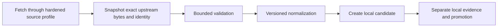

# Federation and import

## ImportSource

An ImportSource is tenant-scoped, disabled by default, and configured only by an authorized federation administrator. It binds exactly one kind—OCI, MCP Registry, A2A, or a future explicitly supported source—to trusted endpoint/origin configuration, authentication reference, schedule/manual mode, normalization profile, and hardened fetch-policy profile.

V1 schedules are `manual` or a bounded interval in seconds; cron expressions and caller-controlled timezones are not supported. A new source always starts disabled and requires a separate ETag-protected enable action. Sources are disabled or retired, not deleted while referenced.

Publisher-controlled metadata cannot modify source trust, credentials, network exceptions, or automatic approval.

## Import process

Import never creates catalog membership, verifies a local Publisher, marks upstream evidence trusted, or implies promotion.

## ImportRecord

An immutable record includes source and tenant IDs, upstream publisher/name/version, source URL or repository, exact upstream revision/digest, observed source bytes/report digest, importer identity/version, timestamps, fetch/validation/normalization profiles, resulting local ArtifactVersion/OCI digest, outcome, and stable reason codes.

Repackaging preserves upstream attribution and separately identifies MP/importer actions.

If upstream content changes without changing its claimed version, MP retains all prior records and creates a conflict. It does not replace the candidate or silently select one. An authorized administrator must resolve mapping/publication through a separately audited action; immutable version conflict rules still apply.

An import run selects only `full` or `incremental`. Incremental cursors are MP-owned opaque source state and are not accepted from callers. Conflict resolution may reject the import or map it to a new unused local semantic version; it can never overwrite an immutable binding.
