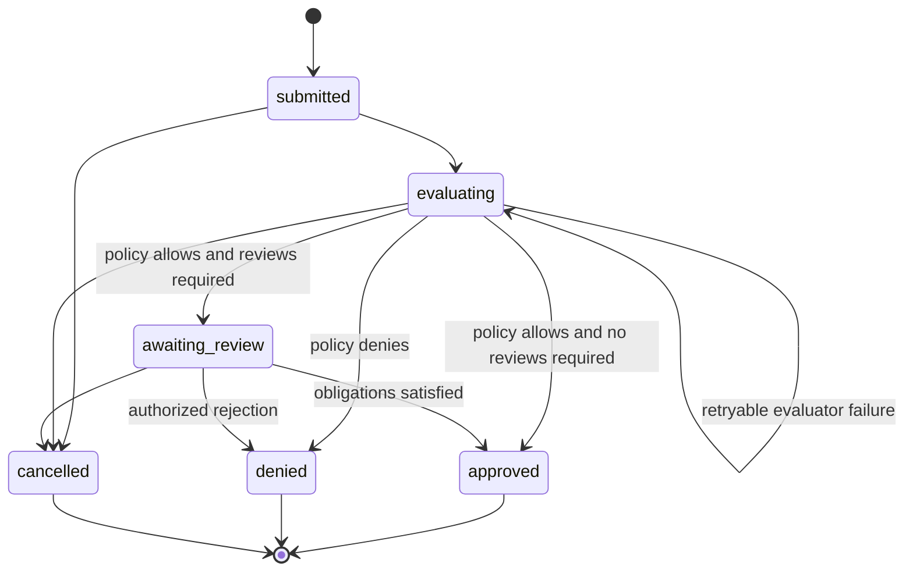

# Promotion workflow

## Request snapshot

A PromotionRequest captures:

- tenant, requester, target catalog, and UUIDv7 request ID;
- exact ArtifactVersion and artifact digest;
- exact canonical dependency lock and lock digest;
- active policy bundle digest and entrypoint;
- immutable evidence IDs and report/record digests;
- canonical policy-input digest;
- requested-at timestamp and idempotency ownership.

The caller supplies only target catalog, root ArtifactVersion, explicit optional-dependency selections, and optional additional evidence references. MP builds the exact lock, selects the complete current trusted policy-relevant evidence set, and binds the catalog's active policy. A caller cannot omit current evidence or override policy.

New or refreshed evidence does not mutate the request. A requester creates a new request to use a different evidence set, artifact, lock, or policy.

## State machine

Unavailable, malformed, invalid, or timed-out policy never creates an approval. A transient evaluator failure remains retryable in `evaluating` with bounded attempt/error metadata. A valid policy denial creates a terminal `denied` decision.

## Reviews and separation of duty

Policy sets the number of distinct authorized reviewers and any role obligations. The protected production baseline requires two distinct reviewers and prohibits the requester from satisfying either review. One principal cannot satisfy multiple slots, including through multiple sessions or credentials mapped to the same principal.

PromotionReview records the exact request snapshot, reviewer principal, decision, reason, and timestamp. It differs from general human-review EvidenceRecord.

The decision endpoint is a deterministic trigger, not a caller-selected outcome. Cancellation before terminal decision is explicit, reasoned, and limited to the requester or authorized catalog administrator.

## Decision transaction

Immediately before approval, MP rechecks authoritative live publisher suspension/revocation, artifact quarantine, and digest revocation. Any unsafe state fails closed. MP does not substitute newer evidence or policy.

Approval atomically creates an immutable PromotionDecision, active CatalogEntry, audit event, and outbox event. Duplicate/concurrent decisions are idempotent and cannot create multiple logical memberships.

Denial and cancellation preserve the full request, policy evaluation, evidence snapshot, and reviews.
